# 系統架構：AgentReady Events

> 對應系列：《網站不只給人用：30 天打造 AI Agent 看得懂的 WebMCP 網站》

| 欄位 | 內容 |
|---|---|
| 文件狀態 | Accepted |
| 文件版本 | 1.0.0 |
| 建立日期 | 2026-06-24 |
| 最後更新日期 | 2026-06-24 |
| 系統名稱 | AgentReady Events |
| 架構型態 | 同源部署的模組化單體（Modular Monolith） |
| 前端 | Vite、TypeScript、Semantic HTML、原生 CSS |
| 後端 | Node.js、Express、TypeScript |
| 資料庫 | SQLite |
| 測試 | Vitest、Playwright、WebMCP deterministic tests、Agent Evals |
| 相關文件 | `00-project-brief.md`、`02-source-list.md`、`04-tool-catalog.md`、`05-webmcp-baseline.md` |

---

## 1. 文件目的

本文件定義 AgentReady Events 的整體系統架構，以及人類使用介面、WebMCP Tools、後端 API、商業規則、資料庫、安全機制與測試系統之間的責任邊界。

本文件要回答以下問題：

1. 人類操作與 AI Agent 操作如何共用同一套商業邏輯？
2. WebMCP 應該放在系統的哪一層？
3. 哪些安全檢查必須由後端負責？
4. WebMCP API 持續變動時，如何降低專案受到的影響？
5. 不支援 WebMCP 的瀏覽器是否仍能完整操作網站？
6. 如何測試確定性的程式行為與非確定性的 Agent 行為？

這份文件描述的是**架構與責任分工**。每一個 Tool 的名稱、描述、參數 Schema、輸出與風險等級，將在 `docs/04-tool-catalog.md` 中正式定義。

---

## 2. 架構決策摘要

AgentReady Events 採用下列核心決策：

| ID | 決策 | 摘要 |
|---|---|---|
| ARCH-001 | WebMCP 是漸進式增強 | 沒有 WebMCP 時，人類仍能完成全部核心操作 |
| ARCH-002 | 採用同源模組化單體 | 前端、API 與 Session 使用同一 Origin，降低 CORS、Cookie 與跨來源工具風險 |
| ARCH-003 | UI 與 Tool 共用 Use Case | 不為 Agent 另外複製一套商業邏輯 |
| ARCH-004 | 後端是最終授權邊界 | Tool 名稱、前端狀態與 Agent 說法都不能取代後端驗證 |
| ARCH-005 | WebMCP API 集中封裝 | Imperative API 透過 Adapter 與 Registry 隔離規格變更 |
| ARCH-006 | Tool 依頁面狀態提供 | 只註冊當下可使用、目的清楚且不重疊的工具 |
| ARCH-007 | 高風險操作必須人類確認 | 報名送出、取消報名等操作不得只靠 Agent 自動完成 |
| ARCH-008 | 確定性測試與 Evals 分離 | 程式正確性使用自動化測試；Agent 選擇與流程使用 Evals |
| ARCH-009 | MVP 不開放跨來源 Tool | 不設定 `exposedTo`，不把 Tool 提供給第三方 Origin |
| ARCH-010 | Agent 執行必須可觀測 | UI 顯示執行狀態，後端留下必要且最小化的稽核紀錄 |

---

## 3. 系統目標

### 3.1 功能目標

系統必須支援：

- 瀏覽、搜尋與篩選活動。
- 查看活動詳細資訊。
- 收藏與取消收藏活動。
- 填寫並送出活動報名資料。
- 查看目前使用者的報名紀錄。
- 經過明確確認後取消報名。
- 匯出個人活動行程。
- 讓 AI Agent 透過 WebMCP Tools 協助完成上述部分流程。
- 顯示目前註冊的 WebMCP Tools 與開發測試資訊。

### 3.2 架構品質目標

| 品質 | 目標 |
|---|---|
| 可理解性 | 每一層只有明確責任，文章讀者能逐日理解架構 |
| 可維護性 | WebMCP 規格變動時，主要修改集中在 Adapter 與 Tool 定義 |
| 安全性 | 所有寫入操作都由後端重新驗證登入、授權、資源歸屬與狀態 |
| 可測試性 | Domain、Use Case、API、UI、Tool 與 Agent Journey 可分層測試 |
| 可觀測性 | 可追蹤 Agent 呼叫、API Request、錯誤與關鍵狀態變更 |
| 漸進增強 | WebMCP 不可用時，網站仍保有完整的人類操作能力 |
| 可展示性 | 每一階段都能對應鐵人賽文章與 Git Tag，形成可重現成果 |

---

## 4. 非目標

本架構不嘗試解決以下項目：

- 不建立通用型 Browser Agent。
- 不建立完整 MCP Server。
- 不實作真實付款與金流。
- 不實作商業級票券、座位與驗票系統。
- 不實作大型活動主辦方後台。
- 不實作第三方 OAuth 或企業 SSO。
- 不實作多租戶 SaaS。
- 不將 WebMCP Tool 暴露給任意跨來源網站或 iframe。
- 不將 SQLite 視為高流量商業系統的最終資料庫選擇。
- 不把 AI Agent 的輸出視為可信任的授權依據。

---

## 5. 架構驅動因素

### 5.1 WebMCP 與頁面生命週期綁定

WebMCP Tools 屬於目前開啟的 Document 與瀏覽器分頁情境。使用者離開頁面或關閉分頁後，工具不應被視為仍然可用。因此 Tool Registry 必須跟著頁面與登入狀態管理生命週期。

### 5.2 WebMCP 仍是實驗性提案

目前實作以 `document.modelContext` 為基準，但 API 仍可能變動。專案不得讓規格細節散落在所有頁面，而應透過 Adapter 集中處理 Imperative API。

### 5.3 Agent 可能做出錯誤選擇

Agent 可能：

- 選錯 Tool。
- 傳入錯誤參數。
- 以錯誤順序呼叫 Tools。
- 忽略 Tool 回傳結果。
- 重複執行寫入操作。

系統必須以清楚 Tool 邊界、Schema、狀態、錯誤訊息、冪等控制與 Evals 降低風險，不能假設 Agent 永遠正確。

### 5.4 人類與 Agent 共享同一個網站狀態

WebMCP 不是另一個獨立後台。Agent 會在使用者目前開啟的網站、登入 Session 與頁面狀態中協助操作，因此 Agent 執行結果必須反映到可見 UI。

### 5.5 WebMCP 不能取代後端安全

即使 Tool 只在特定頁面註冊，攻擊者仍能直接呼叫 HTTP API。後端必須把所有前端輸入視為不可信任資料，並獨立完成認證、授權、驗證與狀態檢查。

---

## 6. 架構原則

### 6.1 一個 Use Case，多個入口

人類按鈕與 WebMCP Tool 是不同入口，但應呼叫相同的 Application Use Case。

```text
Human UI ───────┐
                ├── Frontend Use Case Facade ── API ── Backend Use Case
WebMCP Tool ────┘
```

禁止出現：

```text
Human UI ── 正常權限與驗證 ── Database
WebMCP  ── 另一套簡化邏輯 ─── Database
```

### 6.2 Tool 是介面，不是商業邏輯

Tool Definition 只負責：

- 告訴 Agent 工具名稱、用途與參數。
- 將 Tool Input 轉換為 Use Case Input。
- 傳遞 Interaction Context。
- 將 Use Case Result 轉換成精簡 Tool Output。
- 觸發對應的 UI 狀態更新。

Tool 不直接：

- 連接資料庫。
- 判斷最終權限。
- 複製核心商業規則。
- 保存敏感資料。

### 6.3 後端永遠不信任 Interaction Mode

前端可以傳送 `human` 或 `agent` 供觀測與稽核使用，但此欄位可以被偽造，因此不得用於授權判斷。

### 6.4 先設計人類可用介面，再加入 Agent 能力

Declarative Tool 應建立在語意正確、可鍵盤操作、具 Label 與驗證訊息的 HTML Form 上。WebMCP 是增強層，不是修補不良 UI 的替代品。

### 6.5 Tool 數量保持最小且目的不重疊

每個 Tool 對應單一清楚功能。只有在目前頁面與使用者狀態下確實可用的 Tool 才應存在，以降低 Agent 選擇錯誤與 Context 負擔。

---

# 7. 系統情境圖

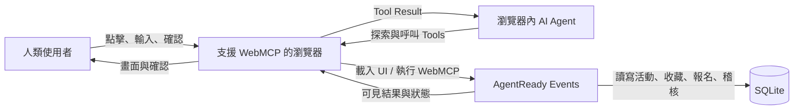

## 7.1 外部角色

| 角色 | 責任與限制 |
|---|---|
| 人類使用者 | 擁有帳號與最終決策權；負責確認高風險操作 |
| 瀏覽器 AI Agent | 依照使用者意圖選擇及呼叫 Tool；不可被視為可信授權者 |
| Web 瀏覽器 | 提供頁面、Session、DOM 與 WebMCP 執行環境 |
| AgentReady Events | 提供 UI、Tools、API、商業規則與資料保存 |

---

# 8. Container 架構

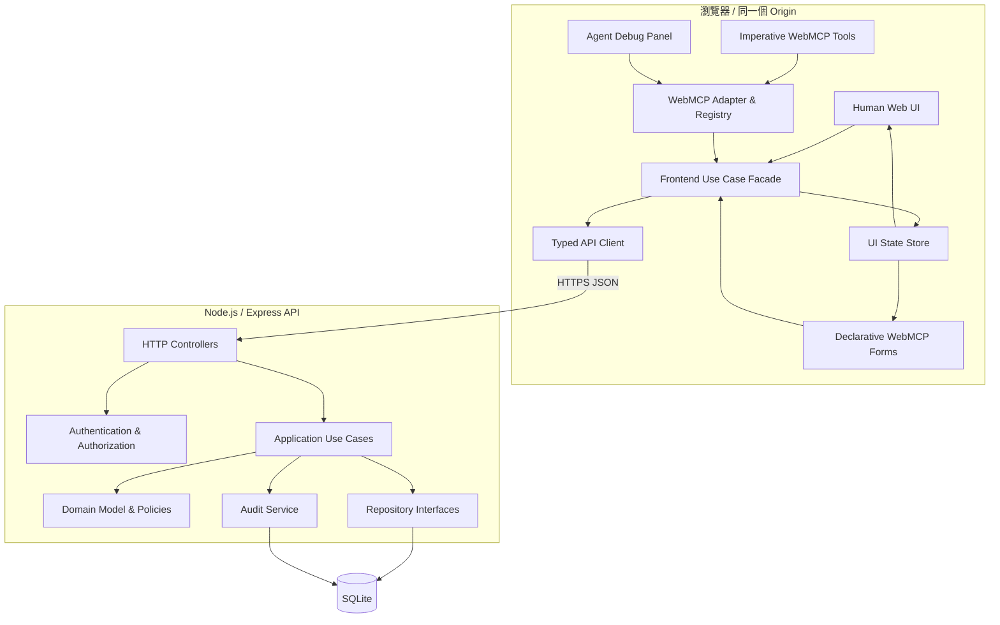

## 8.1 為何採用同源部署

前端與 `/api` 使用同一個 Origin，理由如下：

- 簡化 Cookie Session。
- 減少 CORS 設定與錯誤。
- 降低跨來源 iframe 與 `exposedTo` 的風險。
- 讓 WebMCP Tools、頁面 DOM 與 API Session 保持一致。
- 更適合教學專案與 30 天實作範圍。

此決策不代表未來不能拆分服務；只是在 MVP 階段，分散式架構不會增加 WebMCP 教學價值。

---

# 9. 前端架構

## 9.1 前端分層

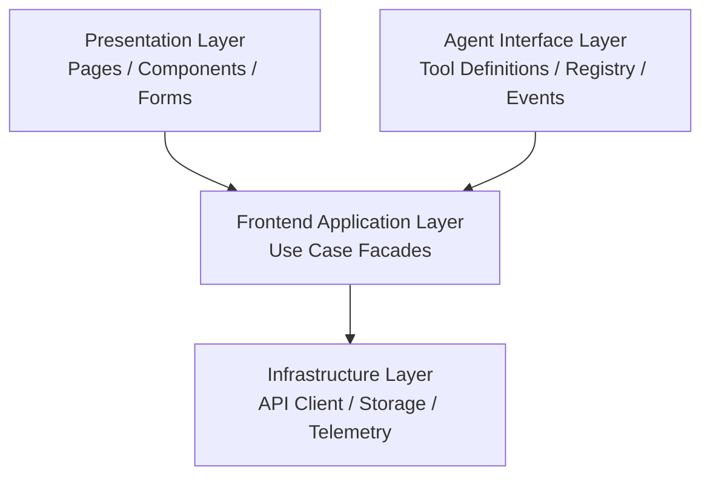

依賴只能由上往下，不允許 Infrastructure 依賴 Presentation。

## 9.2 Presentation Layer

負責：

- 路由與頁面組成。
- 活動列表、活動詳情、收藏、報名與個人報名 UI。
- 語意化 HTML 與無障礙互動。
- 人類使用者的表單驗證回饋。
- Agent 執行時的可見狀態與確認介面。

不負責：

- 直接註冊 Imperative Tool。
- 直接拼接任意 API Request。
- 最終授權判斷。
- 保存核心商業規則。

## 9.3 Agent Interface Layer

包含：

- Declarative Form annotations。
- Imperative Tool definitions。
- `WebMcpAdapter`。
- `WebMcpToolRegistry`。
- Tool lifecycle policies。
- Tool invocation UI feedback。
- Tool input/output mapping。
- Agent Debug Panel integration。

此層是 WebMCP 與一般網站之間的 Anti-Corruption Layer，避免實驗性 API 直接滲透整個專案。

## 9.4 Frontend Application Layer

每一個前端 Use Case Facade 封裝：

1. 呼叫 Typed API Client。
2. 更新 UI Store。
3. 顯示成功或錯誤訊息。
4. 保留必要的 Interaction Context。
5. 回傳適合 UI 或 Tool 使用的結果。

範例：

```typescript
export interface EventActions {
  searchEvents(
    input: SearchEventsInput,
    context: InteractionContext,
  ): Promise<SearchEventsResult>;

  saveEvent(
    eventId: string,
    context: InteractionContext,
  ): Promise<SaveEventResult>;
}
```

## 9.5 UI State Store

MVP 不需要大型全域狀態框架。狀態依用途分為：

| 狀態 | 保存位置 |
|---|---|
| 搜尋條件與結果 | 頁面 Store / URL Query String |
| 目前活動詳情 | 頁面 Store |
| 目前登入者 | Session Bootstrap State |
| 收藏狀態 | Server state + 前端快取 |
| 報名表草稿 | HTML Form / Page Store |
| Agent 執行狀態 | Agent Activity Store |
| Tool 註冊清單 | WebMcpToolRegistry |

重要 Server State 在寫入完成後必須重新同步，不能只樂觀修改畫面而不確認後端結果。

---

# 10. WebMCP 整合架構

## 10.1 能力偵測

所有 WebMCP 初始化前都必須先偵測支援狀態：

```typescript
export function isWebMcpSupported(): boolean {
  return "modelContext" in document;
}
```

如果不支援：

- 不註冊 Imperative Tools。
- Declarative annotations 不得影響正常 Form 行為。
- UI 顯示一般網站功能，不顯示錯誤阻擋使用者。
- Debug Panel 顯示「WebMCP unavailable」。

## 10.2 Adapter 介面

專案自訂 Adapter，不讓其他模組直接依賴瀏覽器實驗 API：

```typescript
export interface ToolRegistration {
  readonly name: string;
  dispose(): void;
}

export interface WebMcpAdapter {
  isSupported(): boolean;

  registerTool<TInput>(
    definition: WebMcpToolDefinition<TInput>,
    options?: WebMcpRegistrationOptions,
  ): Promise<ToolRegistration>;

  listTools(): Promise<ReadonlyArray<DiscoveredTool>>;

  executeToolForDebug(
    toolName: string,
    input: unknown,
    signal?: AbortSignal,
  ): Promise<unknown>;

  onToolsChanged(listener: () => void): () => void;
}
```

`ToolRegistration.dispose()` 內部使用 `AbortController` 解除註冊。這是專案自訂抽象，不代表 WebMCP 規格本身直接回傳 Disposable。

## 10.3 Registry 責任

`WebMcpToolRegistry` 負責：

- 防止同名 Tool 重複註冊。
- 依頁面與登入狀態註冊 Tool。
- 路由離開、狀態失效或登出時解除 Tool。
- 記錄註冊錯誤供 Debug Panel 顯示。
- 提供目前 Tool Snapshot。
- 將 `toolchange` 事件轉換成專案內事件。

Registry 不負責：

- 判斷後端權限。
- 自動繞過 Human-in-the-loop。
- 對任意跨來源網站暴露 Tools。

## 10.4 Declarative Tool 架構

Declarative Tool 直接建立在可用的 HTML Form 上：

```html
<form
  method="get"
  action="/events"
  toolname="search_events"
  tooldescription="Search available events by keyword, date, location, price, and experience level."
>
  <!-- 有 label、name、型別、驗證與 toolparamdescription 的欄位 -->
</form>
```

Declarative Tool 的控制程式負責：

- 監聽 `SubmitEvent.agentInvoked`。
- Agent 觸發時使用 `respondWith()` 回傳精簡結果。
- 監聽 `toolactivated` 與 `toolcancel`。
- 顯示目前由 Agent 填入的內容。
- 對高風險表單保持手動提交，不使用 `toolautosubmit`。

### Declarative Tool 使用原則

| 情境 | 策略 |
|---|---|
| 搜尋與篩選 | 可考慮 `toolautosubmit`，但仍須顯示結果與狀態 |
| 報名資料準備 | 不自動送出，由人類檢查後提交 |
| 含敏感資料表單 | 顯示欄位與資料用途，不在 Tool Output 回傳完整個資 |
| 無 WebMCP 瀏覽器 | Form 仍按標準 HTML 行為正常運作 |

## 10.5 Imperative Tool 架構

Imperative Tool Definition 只做轉接：

```typescript
const getEventDetailsTool: WebMcpToolDefinition<GetEventDetailsInput> = {
  name: "get_event_details",
  description:
    "Return the public details of one event using its event ID. Use after an event has been identified from search results.",
  inputSchema: getEventDetailsSchema,
  annotations: {
    readOnlyHint: true,
    untrustedContentHint: true,
  },
  execute: async (input) => {
    const result = await eventActions.getEventDetails(input, {
      mode: "agent",
      toolName: "get_event_details",
    });

    return toCompactToolOutput(result);
  },
};
```

注意：

- Tool Input 仍須在執行程式中驗證，不能只依賴 JSON Schema。
- 活動描述可能來自外部或使用者內容，因此輸出應標記為不可信內容。
- Tool Output 應保持精簡，只回傳完成目前任務所需資料。
- UI State 必須在成功後同步更新。

## 10.6 Tool 生命週期

詳細 Tool Schema 由 `04-tool-catalog.md` 定義，本文件只固定 Tool availability 原則。

| Tool | 主要頁面／狀態 | 登入需求 | 註冊策略 |
|---|---|---:|---|
| `search_events` | 活動列表頁 | 否 | Declarative Form 隨頁面存在 |
| `get_event_details` | 活動列表或詳情頁 | 否 | 靜態註冊或依頁面註冊 |
| `save_event` | 活動詳情頁 | 是 | 登入且活動可收藏時註冊 |
| `prepare_event_registration` | 報名頁 | 是 | Declarative Form 隨頁面存在 |
| `get_my_registrations` | 我的報名頁 | 是 | 頁面載入後註冊 |
| `cancel_registration` | 我的報名頁 | 是 | 僅存在可取消的報名時註冊 |
| `export_my_schedule` | 我的報名頁 | 是 | 有有效報名時註冊 |

### 生命週期事件

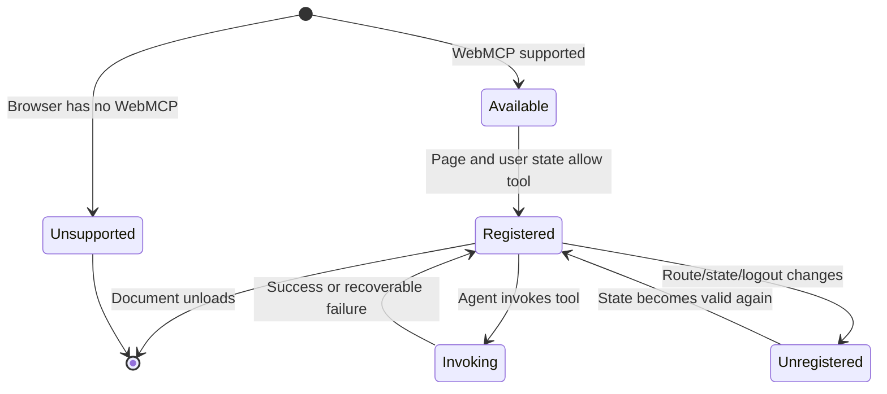

## 10.7 Tool Output 契約

專案內部使用統一結果，再由 Adapter 轉成目前 API 可接受的序列化輸出：

```typescript
export type ToolUseCaseResult<T> =
  | {
      ok: true;
      code: "SUCCESS";
      message: string;
      data: T;
      stateVersion?: string;
    }
  | {
      ok: false;
      code:
        | "VALIDATION_ERROR"
        | "AUTHENTICATION_REQUIRED"
        | "FORBIDDEN"
        | "NOT_FOUND"
        | "CONFLICT"
        | "CONFIRMATION_REQUIRED"
        | "RATE_LIMITED"
        | "TEMPORARY_FAILURE";
      message: string;
      recovery?: string;
      fieldErrors?: Record<string, string>;
    };
```

Tool Output 原則：

- 不回傳 Stack Trace。
- 不回傳 Session、Token 或內部資料庫欄位。
- 不回傳不必要的完整個資。
- 錯誤訊息應告訴 Agent 如何修正，而不是只寫「失敗」。
- Output 必須足以讓 Agent 判斷下一步，但避免過度冗長。

---

# 11. 後端架構

## 11.1 後端分層

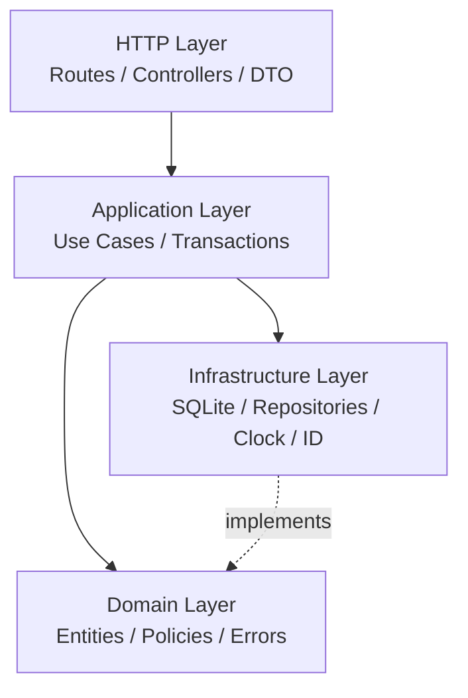

## 11.2 HTTP Layer

負責：

- 解析 Request。
- 驗證基本 DTO 格式。
- 取得 Session User。
- 建立 Request Context。
- 呼叫 Application Use Case。
- 將 Domain/Application Error 映射成 HTTP Response。
- 產生或傳遞 Correlation ID。

不得：

- 直接操作 SQLite。
- 寫入大量商業規則。
- 因為 Request 來自 Agent 就跳過驗證。

## 11.3 Application Layer

預計 Use Cases：

- `SearchEvents`
- `GetEventDetails`
- `SaveEvent`
- `RemoveSavedEvent`
- `CreateRegistration`
- `GetMyRegistrations`
- `CancelRegistration`
- `ExportMySchedule`

每一個寫入 Use Case 必須：

1. 驗證登入身分。
2. 驗證資源存在。
3. 驗證操作權限與資源歸屬。
4. 驗證目前狀態允許操作。
5. 在 Transaction 中寫入資料。
6. 寫入必要 Audit Log。
7. 回傳不含敏感內部資訊的 Result。

## 11.4 Domain Layer

核心 Domain 概念：

| Domain | 主要責任 |
|---|---|
| Event | 活動基本資料、公開狀態、名額與報名期間 |
| SavedEvent | 使用者與收藏活動的關聯 |
| Registration | 報名狀態、取消規則與狀態轉換 |
| RegistrationPolicy | 是否可報名、是否可取消、重複報名判斷 |
| User | Demo 使用者身分與基本資料 |
| AuditEntry | 關鍵操作的不可變紀錄 |

### Registration 狀態

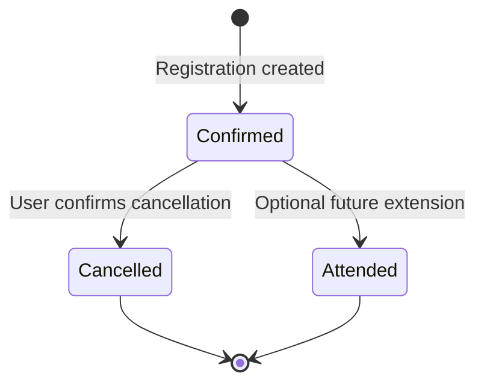

MVP 不允許將 `Cancelled` 直接還原為 `Confirmed`；如要重新參加，必須重新建立報名並重新檢查名額與規則。

## 11.5 Infrastructure Layer

包含：

- SQLite connection 與 migration。
- Repository implementations。
- Transaction manager。
- Server clock abstraction。
- ID generator。
- Structured logger。
- ICS export implementation。

Repository Interface 定義在靠近 Application/Domain 的位置，SQLite 實作放在 Infrastructure，避免 Use Case 依賴 SQL 細節。

---

# 12. 核心資料流

## 12.1 搜尋活動：Agent 唯讀流程

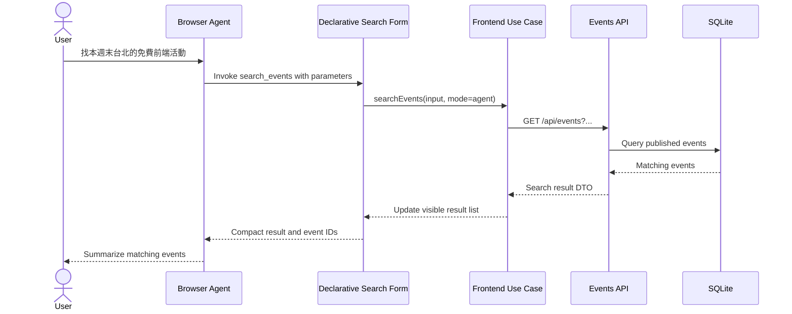

設計重點：

- 搜尋結果顯示於正常 UI。
- Tool Output 使用穩定 Event ID，供下一個 Tool 使用。
- 活動內容視為可能不可信，不能被 Agent 當成系統指令。

## 12.2 報名資料準備：Agent 與人類協作

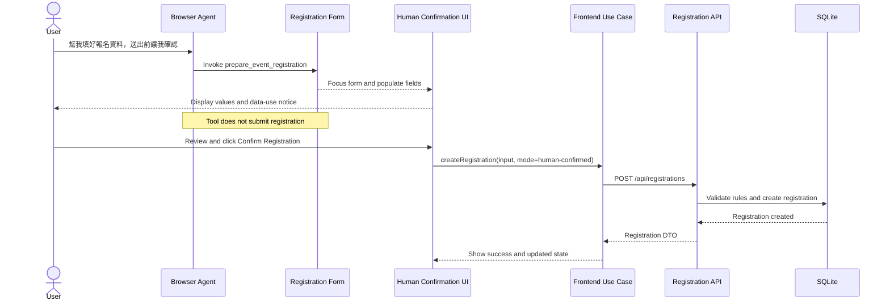

設計重點：

- `prepare_event_registration` 只準備表單。
- 正式寫入由人類點擊確認。
- 後端仍重新驗證活動、名額、重複報名與 Session。

## 12.3 取消報名：高風險流程

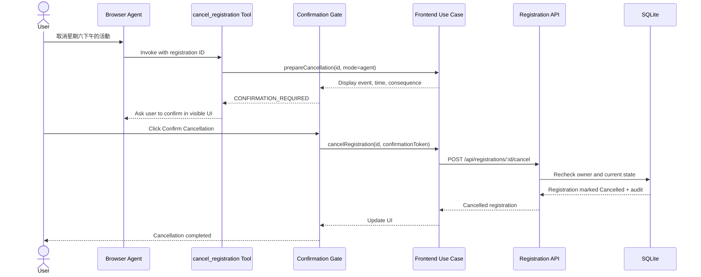

設計重點：

- Agent 第一次呼叫不直接完成取消。
- 確認介面必須可見，清楚指出取消對象與結果。
- 後端不可只信任前端產生的 Confirmation Token；仍要檢查 Session、Owner 與狀態。
- 取消端點設計為冪等：已取消時回傳目前狀態，而不是重複產生副作用。

---

# 13. API 架構

## 13.1 API 風格

- REST-like JSON API。
- 同源 `/api` Prefix。
- 統一錯誤格式。
- 使用 Server-generated Request ID。
- 寫入操作驗證 CSRF。
- Session 使用安全 Cookie。
- 所有時間以 ISO 8601 傳輸，資料庫以 UTC 保存，UI 依使用者時區顯示。

## 13.2 預計 Endpoint

| Method | Endpoint | 用途 | 登入 | 寫入 |
|---|---|---|---:|---:|
| GET | `/api/events` | 搜尋與篩選公開活動 | 否 | 否 |
| GET | `/api/events/:eventId` | 取得活動詳情 | 否 | 否 |
| GET | `/api/session` | 取得目前 Session 摘要 | 否 | 否 |
| PUT | `/api/me/saved-events/:eventId` | 收藏活動 | 是 | 是 |
| DELETE | `/api/me/saved-events/:eventId` | 取消收藏 | 是 | 是 |
| POST | `/api/registrations` | 建立報名 | 是 | 是 |
| GET | `/api/me/registrations` | 取得目前使用者的報名 | 是 | 否 |
| POST | `/api/registrations/:registrationId/cancel` | 取消報名 | 是 | 是 |
| GET | `/api/me/schedule.ics` | 匯出行程 | 是 | 否 |
| GET | `/api/debug/health` | 本機／測試環境診斷 | 視環境 | 否 |

## 13.3 統一成功格式

```json
{
  "data": {},
  "meta": {
    "requestId": "req_01...",
    "serverTime": "2026-06-24T08:00:00Z"
  }
}
```

## 13.4 統一錯誤格式

```json
{
  "error": {
    "code": "REGISTRATION_ALREADY_EXISTS",
    "message": "You are already registered for this event.",
    "recovery": "Open My Registrations to review the existing registration.",
    "fieldErrors": null
  },
  "meta": {
    "requestId": "req_01..."
  }
}
```

HTTP Status 與 Domain Error 的對應由 HTTP Layer 集中管理。

## 13.5 寫入冪等性

Agent 可能重複呼叫 Tool，因此：

- 收藏使用 `PUT`，重複收藏得到相同結果。
- 取消收藏使用 `DELETE`，資源不存在時仍可回傳目前狀態。
- 取消報名使用狀態轉換並檢查目前狀態。
- 建立報名使用資料庫唯一約束避免同一使用者重複報名同一活動。
- 後續如需要，可在寫入 API 加入 `Idempotency-Key`，但不列為第一版必要條件。

---

# 14. 資料模型

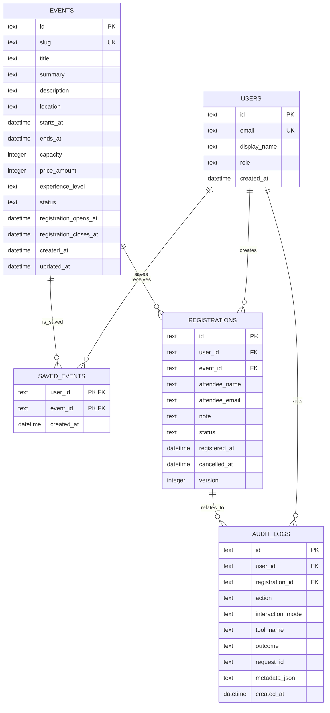

## 14.1 資料約束

至少建立：

- `users.email` 唯一索引。
- `events.slug` 唯一索引。
- `saved_events(user_id, event_id)` 複合主鍵。
- `registrations(user_id, event_id)` 針對有效報名的唯一性策略。
- `registrations.version` 用於避免併發狀態覆寫。
- Audit Log 不保存完整表單內容與敏感 Token。

## 14.2 個資最小化

- Tool Output 不回傳不必要的 Email。
- `get_my_registrations` 只回傳目前使用者自己的資料。
- Audit Metadata 保存 ID、動作與結果，不保存完整個人備註。
- Debug Panel 在正式環境不得顯示敏感 Request Body。

---

# 15. 認證與授權架構

## 15.1 Demo 認證

MVP 使用簡化登入流程與預先建立的 Demo Users，Session 保存於安全 Cookie。

Cookie 至少設定：

- `HttpOnly`
- `Secure`（正式 HTTPS 環境）
- `SameSite=Lax` 或更嚴格設定
- 明確有效期限

此做法只為教學範圍；真實產品應整合成熟 Identity Provider。

## 15.2 授權規則

| 動作 | 規則 |
|---|---|
| 搜尋／查看活動 | 活動必須是 Published 或允許公開查看狀態 |
| 收藏活動 | 使用者已登入；活動存在且可見 |
| 建立報名 | 使用者已登入；報名期間開放；有名額；未重複報名 |
| 查看我的報名 | 只能取得 Session User 的資料 |
| 取消報名 | 報名屬於 Session User；目前狀態可取消；符合取消規則 |
| 匯出行程 | 只匯出 Session User 的有效報名 |

前端隱藏按鈕與 Tool 解除註冊只是 UX，不是授權控制。

---

# 16. 安全架構

## 16.1 Trust Boundary

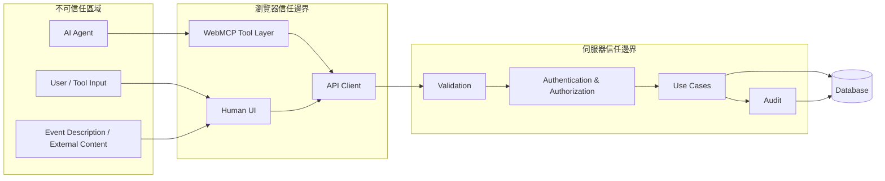

## 16.2 安全控制矩陣

| 風險 | 控制 |
|---|---|
| Agent 傳入惡意參數 | Schema + Runtime validation + Domain rules |
| Prompt Injection | 活動內容視為不可信；使用 `untrustedContentHint`；禁止內容指令觸發授權動作 |
| Agent 越權 | 每個 API Request 依 Session 與 Resource Ownership 驗證 |
| 重複寫入 | 冪等 Endpoint、唯一約束、狀態轉換與版本欄位 |
| CSRF | SameSite Cookie + CSRF Token／Header 驗證 |
| XSS | 輸出編碼；如支援 Markdown，使用可信 Sanitizer 與嚴格設定 |
| Session 洩漏 | HttpOnly、Secure Cookie；不把 Token 放在 Tool Output 或 Local Storage |
| 跨來源 Tool 存取 | MVP 不設定 `exposedTo`；不委派 `tools` Permissions Policy 給第三方 |
| 敏感操作誤執行 | 可見確認介面、清楚操作摘要、後端再次驗證 |
| Tool Context 過大 | 最小 Tool 數量、精簡描述、精簡 Output |
| Debug 資訊外洩 | Debug Route 僅開發／測試環境啟用 |

## 16.3 Tool Annotation 原則

- 唯讀 Tool 設定 `readOnlyHint: true`。
- 回傳外部內容或活動描述的 Tool 設定 `untrustedContentHint: true`。
- 寫入 Tool 明確設定為非唯讀。
- Annotation 是提供 Agent 的提示，不是後端安全控制。

## 16.4 跨來源政策

MVP 固定：

```text
exposedTo = undefined
Cross-origin iframe tools delegation = disabled
Same-origin tools only
```

未來若要開放跨來源，必須另寫 ADR，逐一列出可信 Origin、資料範圍、撤銷方式與測試案例。

---

# 17. Human-in-the-loop 政策

## 17.1 風險分級

| 等級 | 範例 | 預設策略 |
|---|---|---|
| R0：唯讀公開資料 | 搜尋活動、查看活動 | 可由 Agent 自動執行 |
| R1：低風險個人狀態 | 收藏活動 | 可執行，但 UI 顯示結果並可撤銷 |
| R2：個資或承諾前準備 | 填寫報名表、查看個人報名 | 驗證登入；資料可見；不自動做最終承諾 |
| R3：具後果的寫入 | 正式報名、取消報名 | 必須由人類明確確認 |

## 17.2 確認介面要求

確認介面必須顯示：

- 即將執行的動作。
- 對象名稱與識別資訊。
- 日期、時間與必要後果。
- 哪些資料將被送出。
- 明確的「確認」與「取消」。
- 操作完成或失敗的可見狀態。

不得使用模糊文案，例如只有「確定嗎？」而沒有顯示取消哪一場活動。

## 17.3 不依賴尚未穩定的互動 API

若規格中的使用者互動 API 尚未在目標 Chrome 版本穩定，MVP 使用網站自身可見 Dialog 與 Confirmation Gate，不把核心安全流程建立在未固定的實驗方法上。

---

# 18. 錯誤處理與可靠性

## 18.1 錯誤分類

| 類型 | 是否可重試 | 例子 |
|---|---:|---|
| Validation | 修正輸入後可 | 日期格式錯誤、缺少必要欄位 |
| Authentication | 登入後可 | Session 過期 |
| Authorization | 通常不可 | 取消他人的報名 |
| Not Found | 重新搜尋後可 | 活動或報名不存在 |
| Conflict | 重新讀取狀態後可 | 活動額滿、已報名、已取消 |
| Rate Limit | 稍後可 | 搜尋頻率過高 |
| Temporary | 可 | 網路逾時、資料庫暫時錯誤 |
| Internal | 不應由 Agent 自行猜測 | 未預期程式錯誤 |

## 18.2 Tool 錯誤訊息原則

錯誤訊息包含：

- 發生什麼事。
- 哪個欄位或狀態不合法。
- 下一個安全可行步驟。

例如：

```json
{
  "ok": false,
  "code": "EVENT_CAPACITY_FULL",
  "message": "This event no longer has available capacity.",
  "recovery": "Search for another event on the same date or return to the event list."
}
```

## 18.3 Timeout 與取消

- API Client 設定合理 Timeout。
- Debug Tool execution 支援 `AbortSignal`。
- 頁面離開時取消不再需要的 Request。
- Tool 被解除註冊時，不應留下持續寫入的背景流程。
- 寫入結果不明時，先重新查詢目前 Server State，再決定是否重試。

## 18.4 UI 與 Tool 結果一致性

完成寫入後依序：

1. 等待 Server 成功回應。
2. 更新 Server State Cache。
3. 更新可見 UI。
4. 產生 Tool Output。

不可在後端尚未確認前，先向 Agent 回覆「已完成」。

---

# 19. 可觀測性與稽核

## 19.1 Request Context

```typescript
export interface RequestContext {
  requestId: string;
  userId?: string;
  interactionMode: "human" | "agent" | "unknown";
  toolName?: string;
  userAgent?: string;
  occurredAt: string;
}
```

`interactionMode` 與 `toolName` 只用於觀測，不作為授權依據。

## 19.2 Agent Activity Panel

前端顯示最近操作：

- Tool 名稱。
- 開始與結束時間。
- 目前狀態：Running、Needs confirmation、Succeeded、Failed、Cancelled。
- 對 UI 造成的變更摘要。
- 可安全顯示的錯誤訊息。

不得顯示：

- Session Cookie。
- CSRF Token。
- 完整個人資料。
- Internal Stack Trace。

## 19.3 Audit Log

記錄高價值事件：

- 建立報名。
- 取消報名。
- 收藏／取消收藏可視需求決定是否記錄。
- 驗證失敗與越權嘗試可寫 Security Log，不一定寫入 Domain Audit Table。

Audit Entry 至少包含：

- User ID。
- Action。
- Resource ID。
- Outcome。
- Interaction Mode。
- Tool Name（若有）。
- Request ID。
- Timestamp。

---

# 20. Progressive Enhancement 與相容性

## 20.1 基本原則

```text
Human-capable website first
           +
WebMCP structured tool enhancement
```

不支援 WebMCP 時：

- 搜尋 Form 仍可提交。
- 收藏按鈕仍可操作。
- 報名 Form 仍可填寫與送出。
- 個人報名與取消流程仍可完成。
- 唯一缺少的是 Agent 的 Tool discovery 與 invocation。

## 20.2 Feature Flags

建議設定：

| Flag | 用途 |
|---|---|
| `WEBMCP_ENABLED` | 控制專案是否初始化 WebMCP Layer |
| `WEBMCP_DEBUG_PANEL` | 控制 Debug Panel，正式環境預設關閉 |
| `WEBMCP_EVAL_MODE` | 測試環境提供固定資料與額外診斷 |
| `AUDIT_AGENT_ACTIONS` | 控制是否記錄低風險 Agent 操作 |

## 20.3 版本基準

WebMCP API、Chrome 版本、Flag、Origin Trial 與已知限制不在本文件鎖定，統一由 `docs/05-webmcp-baseline.md` 維護。

---

# 21. 測試架構

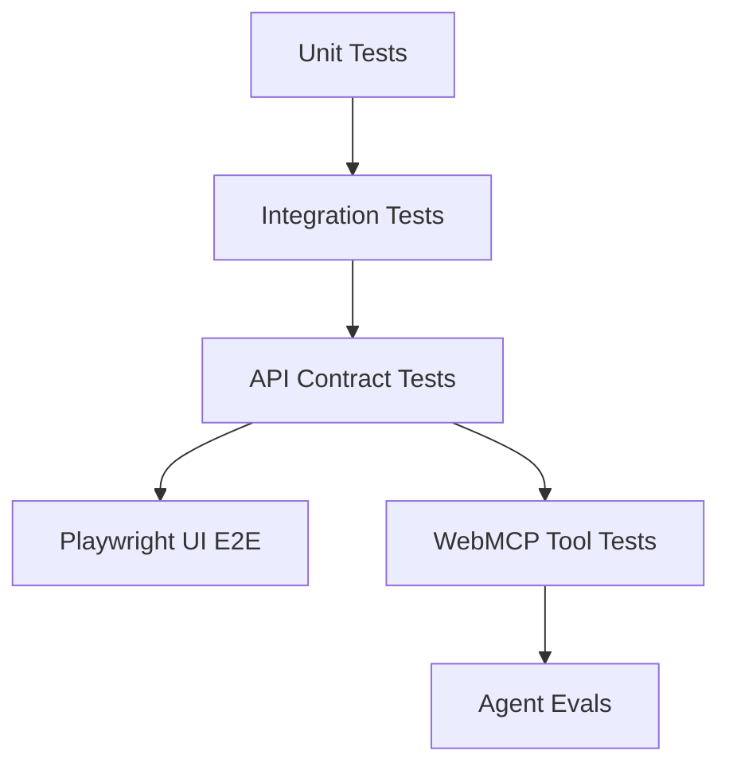

## 21.1 Unit Tests

測試：

- Registration Policy。
- Event availability。
- Runtime input validation。
- Result mapping。
- Tool description、name 與 Schema 快照。
- Adapter 的支援偵測與錯誤處理。

## 21.2 Integration Tests

使用測試 SQLite Database 驗證：

- Repository。
- Transaction。
- 唯一約束。
- 報名與取消狀態轉換。
- Audit Log。

## 21.3 API Contract Tests

驗證：

- HTTP Status。
- Response DTO。
- 統一錯誤格式。
- Session 與 CSRF。
- 資源歸屬與越權阻擋。
- 冪等行為。

## 21.4 UI E2E Tests

Playwright 測試：

- 人類完整搜尋流程。
- 收藏與取消收藏。
- 報名表驗證。
- 人類確認送出。
- 取消報名確認 Dialog。
- 不支援 WebMCP 時的正常操作。
- Agent 執行狀態的視覺與焦點回饋。

## 21.5 Deterministic WebMCP Tests

在支援環境中：

- 以 `getTools()` 驗證目前 Tool 清單。
- 以 `executeTool()` 手動執行 Tool。
- 驗證 Tool lifecycle 與 `toolchange`。
- 驗證輸入錯誤與精簡輸出。
- 驗證頁面或登入狀態改變後 Tool 是否正確解除註冊。

## 21.6 Agent Evals

Evals 不取代 Unit Tests，主要測試：

- Agent 是否選對 Tool。
- 參數是否正確。
- 是否遵守必要工具順序。
- 是否使用前一個 Tool 回傳的 Event ID。
- 是否在 R3 操作等待人類確認。
- 面對 Prompt Injection 內容是否仍遵守資料／指令邊界。
- 完整 Critical User Journey 是否成功。

Eval Dataset 至少包含：

- 正常意圖。
- 語意相近但應選不同 Tool 的意圖。
- 缺少必要資訊的意圖。
- 矛盾條件。
- 惡意活動內容。
- 重複操作。
- Session 過期。
- 活動額滿與狀態過期。

---

# 22. 部署架構

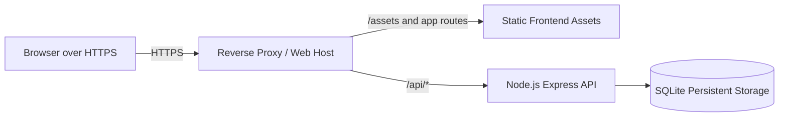

## 22.1 部署要求

- 正式 Demo 使用 HTTPS，因 WebMCP 介面屬於 Secure Context 範圍。
- SPA Route 必須回退至 `index.html`。
- `/api` 不可被靜態回退規則攔截。
- SQLite 檔案需要持久化儲存與備份策略。
- Migration 在部署時明確執行，不由每個 Request 自動執行。
- Health Check 不回傳敏感設定。
- Debug Panel 與測試用帳號在正式展示環境需有限制。

## 22.2 本機環境

```text
http://localhost:5173  -> Vite development server
http://localhost:3000  -> Express API
Vite proxy /api        -> Express API
```

本機可使用 WebMCP Testing Flag；正式 Demo 的 Origin Trial 或實際啟用方式由 `05-webmcp-baseline.md` 決定。

---

# 23. Repository 結構

```text
agent-ready-events/
├─ apps/
│  ├─ web/
│  │  ├─ src/
│  │  │  ├─ app/
│  │  │  ├─ pages/
│  │  │  ├─ components/
│  │  │  ├─ forms/
│  │  │  ├─ application/
│  │  │  ├─ state/
│  │  │  ├─ api/
│  │  │  ├─ webmcp/
│  │  │  │  ├─ adapter/
│  │  │  │  ├─ declarative/
│  │  │  │  ├─ tools/
│  │  │  │  ├─ registry/
│  │  │  │  ├─ debug/
│  │  │  │  └─ types/
│  │  │  └─ observability/
│  │  └─ tests/
│  └─ api/
│     ├─ src/
│     │  ├─ http/
│     │  ├─ application/
│     │  ├─ domain/
│     │  ├─ infrastructure/
│     │  ├─ auth/
│     │  ├─ audit/
│     │  └─ config/
│     └─ tests/
├─ packages/
│  ├─ contracts/
│  ├─ validation/
│  └─ test-fixtures/
├─ database/
│  ├─ migrations/
│  └─ seeds/
├─ tests/
│  ├─ e2e/
│  ├─ webmcp/
│  └─ evals/
├─ docs/
│  ├─ 00-project-brief.md
│  ├─ 01-series-outline.md
│  ├─ 02-source-list.md
│  ├─ 03-architecture.md
│  ├─ 04-tool-catalog.md
│  ├─ 05-webmcp-baseline.md
│  └─ decisions/
├─ articles/
├─ package.json
├─ tsconfig.base.json
└─ README.md
```

## 23.1 套件責任

| Package | 責任 |
|---|---|
| `contracts` | API Request／Response DTO 與共用型別，不包含 Server Secret |
| `validation` | 可在 Client 與 Server 共用的基本資料驗證 Schema |
| `test-fixtures` | 固定活動、使用者與報名測試資料 |

Domain Entities 不建議直接放入共用 Package 暴露給前端；前端只依賴 DTO 與必要型別，避免將 Server Domain Model 當成傳輸格式。

---

# 24. 設定與環境變數

```text
NODE_ENV
PORT
DATABASE_PATH
SESSION_SECRET
CSRF_SECRET
PUBLIC_BASE_URL
WEBMCP_ENABLED
WEBMCP_DEBUG_PANEL
WEBMCP_EVAL_MODE
AUDIT_AGENT_ACTIONS
LOG_LEVEL
```

規則：

- Secret 不提交 Git。
- 前端可讀變數必須使用明確 Public Prefix。
- Tool Definition 不得包含 Secret。
- 測試環境使用獨立 Database。
- Production 啟動時若必要 Secret 缺失，應立即失敗，而不是以弱預設值繼續執行。

---

# 25. 架構決策詳述

## ADR-A：選擇模組化單體，不先拆 Microservices

**理由：**

- 核心目標是展示 WebMCP，而不是分散式系統。
- 目前 Domain 數量有限。
- SQLite 與單一部署最容易重現。
- Transaction、Session、測試與文章教學較清楚。

**代價：**

- 不能獨立擴展各服務。
- 未來若規模增加，需要重新評估資料庫與部署。

## ADR-B：使用原生 Web 平台，不先綁定大型前端框架

**理由：**

- 清楚展示 HTML Form 與 Declarative API。
- 避免框架生命週期遮蔽 WebMCP 核心概念。
- 降低 30 天教學的先備知識。

**代價：**

- 需自行管理部分 UI State 與組件慣例。
- 大型應用的開發體驗可能不如成熟框架。

## ADR-C：Imperative API 透過 Adapter

**理由：**

- WebMCP API 正在變動。
- `document.modelContext`、Tool lifecycle 與 debug methods 可集中調整。
- 容易在測試中替換 Fake Adapter。

**代價：**

- 多一層抽象。
- 必須清楚區分「專案 Adapter API」與「瀏覽器原生 API」。

## ADR-D：高風險 Tool 不直接完成最終操作

**理由：**

- Agent 行為具有機率性。
- 取消與正式報名會產生真實後果。
- 可見確認能維持使用者控制權。

**代價：**

- Agent 無法完全無人值守完成所有流程。
- 流程需要額外 Confirmation Gate 與 UI State。

## ADR-E：MVP 同源且不開放跨來源 Tools

**理由：**

- 縮小攻擊面。
- 避免 `exposedTo`、iframe Permissions Policy 與第三方信任管理干擾主線。
- 讓教學先聚焦 Tool design、state 與 safety。

**代價：**

- 無法展示跨站 Agent iframe 整合。
- 此功能只能作為完賽後延伸。

---

# 26. 已知風險與取捨

| 風險 | 影響 | 對策 |
|---|---|---|
| WebMCP API 變更 | 程式碼與文章失效 | Adapter、Baseline 文件、每日版本註記 |
| Agent Tool selection 不穩 | Demo 偶發失敗 | 減少重疊 Tool、Evals、清楚 Schema 與描述 |
| SQLite 併發限制 | 高流量時受限 | 定位為教學 Demo；保留 Repository 邊界方便替換 |
| 原生前端程式逐漸複雜 | 狀態管理成本增加 | 嚴格模組化、Page Store、Facade、事件邊界 |
| Human-in-the-loop 增加流程步驟 | 自動化感降低 | 僅套用於真正高風險操作，其他流程保持順暢 |
| Agent Interaction Mode 可偽造 | 稽核可信度有限 | 僅作觀測，不用於授權；以 Session 與 Server Rule 為準 |
| Prompt Injection 無法被完全消除 | Agent 可能受惡意內容影響 | 不可信內容標註、最小權限、確認、後端邊界、紅隊測試 |
| Chrome-only 實驗環境 | 一般使用者無法體驗 Tool | 保留完整人類 UI、錄製 Demo、提供 deterministic Debug Panel |

---

# 27. Definition of Done

本架構可視為完成落地，至少需滿足：

## 前端

- [ ] 所有核心功能可由人類 UI 完成。
- [ ] WebMCP 不支援時不影響核心流程。
- [ ] Declarative Forms 具 Label、Validation 與鍵盤操作能力。
- [ ] Imperative Tools 透過 Adapter 註冊。
- [ ] Tool 依頁面與登入狀態正確註冊／解除。
- [ ] Agent 執行結果反映在可見 UI。
- [ ] 高風險流程具有可見確認介面。

## 後端

- [ ] 所有寫入操作驗證 Session、授權、資源狀態與輸入。
- [ ] UI 與 Tool 使用相同 API／Use Case。
- [ ] 報名與取消具正確狀態轉換及唯一約束。
- [ ] 高價值操作留下最小必要 Audit Log。
- [ ] 統一錯誤格式與 Request ID 已實作。

## 安全

- [ ] Session Cookie 與 CSRF 防護已實作。
- [ ] Tool Output 不包含 Secret 或不必要個資。
- [ ] 唯讀與不可信內容 Annotation 正確設定。
- [ ] MVP 未開放跨來源 Tool 存取。
- [ ] Prompt Injection 與越權案例有測試。

## 測試

- [ ] Domain 與 Use Case 具 Unit Tests。
- [ ] API 權限、狀態與錯誤具 Integration Tests。
- [ ] 人類核心流程具 Playwright E2E。
- [ ] Tool discovery、execution 與 lifecycle 具 deterministic tests。
- [ ] 至少 20 組 Agent Eval Cases。

---

# 28. 建議實作順序

| 階段 | 實作內容 | 對應文章 |
|---|---|---|
| 1 | 建立前後端骨架、資料庫、活動列表與搜尋 | Day 6～7 |
| 2 | 完成語意化搜尋 Form 與 Declarative Tool | Day 8～10 |
| 3 | 建立 WebMcpAdapter、Registry 與 Debug Panel | Day 11～15 |
| 4 | 建立 Frontend Facade 與共用 API Use Cases | Day 16 |
| 5 | 完成詳情、收藏與第一條多 Tool Journey | Day 17 |
| 6 | 完成報名 Form、Confirmation Gate 與 Session | Day 18～21 |
| 7 | 完成取消報名、冪等與 Audit | Day 22 |
| 8 | 加入 Prompt Injection 測試與 Annotation | Day 23～24 |
| 9 | 完成 Unit、Integration、E2E 與 Tool Tests | Day 25 |
| 10 | 建立 Eval Dataset 與失敗情境 | Day 26～27 |
| 11 | 完成 Activity Panel、部署與相容降級 | Day 28～29 |
| 12 | 最終 Demo、文件、檢查表與架構回顧 | Day 30 |

---

# 29. 待後續文件定案的項目

以下內容不在本文件最終決定：

1. 每個 Tool 的正式 description 與 JSON Schema：`04-tool-catalog.md`。
2. Chrome 版本、Flag、Origin Trial 與 API Snapshot：`05-webmcp-baseline.md`。
3. 具體 UI Wireframe 與視覺規範：後續 UI 文件。
4. Eval Prompt、Expected Call 與評分方式：`tests/evals/` 與 Eval 規格文件。
5. Production hosting provider：部署前依實際需求決定。

---

# 30. 來源依據

本架構主要依據 `docs/02-source-list.md` 中的下列來源：

- `WMCP-001`：WebMCP Specification Draft。
- `WMCP-002`：WebMCP 官方 Repository。
- `CHROME-001`：WebMCP Overview。
- `CHROME-002`：Critical User Journeys。
- `CHROME-003`：Declarative API。
- `CHROME-004`：Imperative API。
- `CHROME-005`：WebMCP Best Practices。
- `CHROME-006`：WebMCP Tool Security。
- `CHROME-007`：WebMCP Evals。
- `CHROME-008`：WebMCP 與 MCP 的使用時機。
- `WEB-001`：WHATWG HTML Forms。
- `WEB-003`：Secure Contexts。
- `WEB-004`：Permissions Policy。
- `SECURITY-001`～`SECURITY-006`：Prompt Injection、授權、Session、CSRF 與 XSS 安全來源。
- `A11Y-001`～`A11Y-003`：表單、WCAG 與互動元件無障礙來源。

重要基準：

- WebMCP 是建議中的實驗性 Web 標準，應視為漸進式增強。
- 現行 Chrome 文件使用 `document.modelContext`。
- Declarative API 以標準 HTML Form annotations 建立 Tool。
- Imperative Tool 可用 `AbortSignal` 管理註冊生命週期。
- Tool 應目的清楚、數量最小、依頁面狀態提供。
- Tool Input 必須由程式嚴格驗證；Schema 不能取代 Runtime 與後端驗證。
- 唯讀與不可信內容應使用對應 Annotation hints。
- 確定性程式行為仍使用傳統測試，Agent 行為另外使用 Evals。

---

# 31. 變更紀錄

| 版本 | 日期 | 變更 |
|---|---|---|
| 0.1.0 | 2026-06-24 | 建立初版架構、資料流、安全、測試與部署設計 |
| 1.0.0 | 2026-06-24 | Tool Catalog 與 WebMCP Baseline 定案，架構狀態轉為 Accepted |
