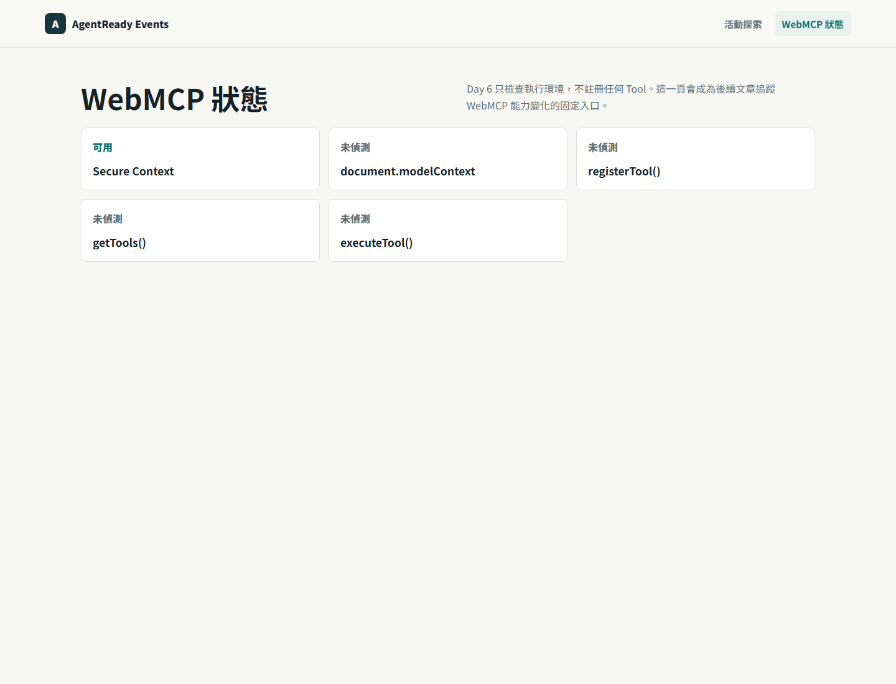

# Day 06｜把實驗環境架起來：WebMCP Runtime 與 Diagnostics Baseline

> 草稿狀態：可開始細修。
> 對應程式版本：`day-06-webmcp-diagnostics`

前五天我們先談題目、使用者旅程、架構和 Tool Catalog。從今天開始，系列進入實作。

但 Day 6 我不急著建立 `search_events`。

原因很簡單：在網站公開任何 Tool 之前，我們要先知道目前瀏覽器環境到底能不能承載 WebMCP。否則一開始就把程式碼寫進表單或 Tool handler，很容易把三件事混在一起：

1. 網站本身能不能跑。
2. 瀏覽器有沒有 WebMCP runtime 入口。
3. Agent 能不能發現並呼叫某個 Tool。

這三件事看起來都和「Agent-ready」有關，但它們不是同一層。

Day 6 的目標是建立第一層基準線：網站能啟動，API 有 health check，前端有 diagnostics page，可以檢查 secure context 與 `document.modelContext` 等 WebMCP 相關入口。


## 今天要完成什麼

今天的成果不是一個 Tool，而是一個可重複檢查的實驗環境。

本日完成：

- 建立 AgentReady Events 的基本網站骨架。
- 建立 API health check。
- 建立 WebMCP diagnostics page。
- 檢查 secure context。
- 檢查 `document.modelContext` 是否存在。
- 檢查 `registerTool()`、`getTools()`、`executeTool()` 是否可用。

這些檢查不會讓網站自動變成 Agent-ready。它們的價值是幫我們回答：「現在這個瀏覽器環境有沒有露出 WebMCP 相關能力？」

## 為什麼第一天不先寫 Tool

如果一開始就寫 `search_events`，文章會很快進入 `toolname`、schema、submit lifecycle。那些都很重要，但它們需要建立在一個前提上：我們知道瀏覽器的 WebMCP runtime 狀態。

WebMCP 還在演進中。不同 Chrome 版本、flag、origin trial 狀態，都可能影響 `document.modelContext` 是否存在，以及相關 API 是否可用。

所以我把 Day 6 切成一個很窄的範圍：

- 不註冊 Tool。
- 不示範 Agent 呼叫。
- 不宣稱 Chrome Agent 已經成功操作網站。
- 只建立 runtime diagnostics baseline。

這樣做有一個好處：後面 Day 8、Day 9、Day 10 每次加入新能力時，都可以回到同一個 diagnostics page 檢查狀態，而不是靠印象判斷。

## 專案先像一般產品網站

AgentReady Events 不是 WebMCP 文件站，也不是 API playground。它是一個活動探索網站。

這點很重要。WebMCP 的目的不是把網站變成只給 Agent 用的介面，而是讓原本給人類使用的網站，也能把可操作能力用結構化方式提供給 Agent。

所以首頁先保留活動網站的樣子。WebMCP 狀態放在 diagnostics page，而不是搶走首頁主畫面。

這個設計會一路影響後面的實作：

- Day 7 先做一個人類可用的搜尋表單。
- Day 8 才把搜尋表單標記成 `search_events`。
- Day 9 補欄位描述和 schema snapshot。
- Day 10 再處理 Agent submit lifecycle。

今天只處理第一步：環境。

## API health check

後續的搜尋、收藏、報名都會需要後端 API。Day 6 先建立最小的 health check：

```http
GET /health/live
```

回傳：

```json
{
  "status": "ok"
}
```

這個 endpoint 不代表業務功能完成。它只代表 API process 有啟動，而且前端開發時可以知道後端服務是否活著。

Day 6 先把這種最小可觀測性放進專案，是為了避免後面 debug WebMCP 時，把「API 沒啟動」誤判成「WebMCP 沒作用」。

## WebMCP diagnostics page

Day 6 的主角是 `#/diagnostics`。



這個頁面先檢查五件事：

| 檢查項目 | 目的 |
| --- | --- |
| Secure Context | 確認目前頁面是否在安全上下文中執行。 |
| `document.modelContext` | 確認 WebMCP 的主要入口是否存在。 |
| `registerTool()` | 確認 Imperative Tool 註冊能力是否存在。 |
| `getTools()` | 確認是否能讀取可用 Tool。 |
| `executeTool()` | 確認是否能執行 Tool。 |

Day 6 的程式不會因為某一項不存在就停止。Diagnostics page 的任務是揭露環境狀態，不是強迫所有瀏覽器都支援 WebMCP。

概念上，它像這樣：

```ts
export function detectWebMcpSupport(): Record<string, boolean> {
  const documentWithModelContext = document as Document & {
    modelContext?: unknown;
  };

  const modelContext = documentWithModelContext.modelContext as {
    registerTool?: unknown;
    getTools?: unknown;
    executeTool?: unknown;
  } | undefined;

  return {
    secureContext: window.isSecureContext,
    documentModelContext: "modelContext" in documentWithModelContext,
    registerTool: typeof modelContext?.registerTool === "function",
    getTools: typeof modelContext?.getTools === "function",
    executeTool: typeof modelContext?.executeTool === "function"
  };
}
```

這段程式有兩個重點。

第一，它用 feature detection，而不是直接假設 `document.modelContext` 一定存在。這讓網站可以在一般瀏覽器中正常顯示狀態，而不是直接噴錯。

第二，它只回答「有沒有這些入口」。它不回答「Agent 是否已經成功呼叫某個 Tool」。

## 為什麼要把 diagnostics 和產品畫面分開

如果把 WebMCP 狀態直接放在首頁主視覺，網站很快會變成教學頁。

但這個系列想示範的是另一件事：一個原本服務人類的活動網站，如何逐步變成 Agent-ready。

所以我把畫面分成兩層：

- 首頁：給使用者找活動。
- Diagnostics page：給開發、文章截圖和 runtime 檢查使用。

這樣後續寫文章時，也比較不會把 WebMCP 當成一個浮在產品外面的 demo。WebMCP 是背後的能力，不是首頁的裝飾。

## 今天的證據層級

這一天的截圖只能證明三件事：

1. 本地 demo 網站可以啟動。
2. Diagnostics page 可以讀取目前瀏覽器暴露的 runtime 狀態。
3. 專案已經建立 WebMCP feature detection 的基準頁。

它不能證明：

- Agent discovery 已在目標 Chrome / WebMCP runtime 中完成。
- 任何 Tool 已被目標 Chrome / WebMCP runtime 呼叫。
- 目前瀏覽器已完整支援本系列後續使用的 WebMCP 行為。

換句話說，Day 6 的成果是 E1～E2 等級的本地實作與流程素材，不是 E4 等級的真實 Agent / DevTools invocation 證據。

這個界線很重要。因為如果把 diagnostics 截圖寫成真實 Agent runtime 驗證，後面文章的可信度會直接壞掉。

## 今日完成標準

Day 6 完成後，我希望專案符合這幾個條件：

- [x] 網站首頁可開啟。
- [x] API health check 可回傳 `{ "status": "ok" }`。
- [x] `#/diagnostics` 可顯示 WebMCP runtime 狀態。
- [x] 程式碼不使用 legacy `navigator.modelContext` 作為主線入口。
- [x] 文章截圖明確標註為本地 demo diagnostics，不宣稱真實 Agent invocation。

對應版本：

```bash
git checkout day-06-webmcp-diagnostics
```

## 小結

今天我們沒有做出任何 Tool。

這不是進度慢，而是刻意把地基打清楚。WebMCP 的實作不能只看 HTML attribute 有沒有加上去，也不能只看畫面能不能截圖。它需要一條可重複檢查的路徑，確認目前環境支援到哪裡。

Day 6 的 diagnostics page 就是這條路徑的起點。

下一篇 Day 7，我們會先完成一個人類可用的活動搜尋表單。等表單本身穩定後，Day 8 才把它變成第一個 Declarative Tool：`search_events`。

## Reality Checklist 自審

套用文件：`docs/06-webmcp-reality-checklist.md`

- [x] 本文只宣稱完成 runtime diagnostics baseline。
- [x] 本文有說明 `document.modelContext` 可能不存在。
- [x] 本文沒有宣稱已註冊或呼叫 `search_events`。
- [x] 本文沒有把 diagnostics 截圖標註為真實 Agent invocation。
- [x] 本文有說明目前證據層級主要是本地實作與流程素材。
- [x] 本文保留「實際 Chrome / WebMCP runtime 支援狀態需另行驗證」的邊界。

證據層級：

> 本文停在本地 demo 與 diagnostics feature detection；真實 Chrome / WebMCP runtime 支援狀態需另行驗證，並記錄目標瀏覽器版本。
