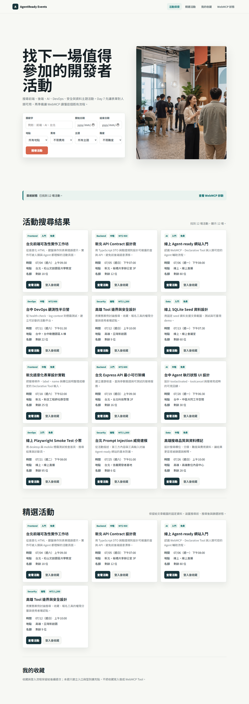
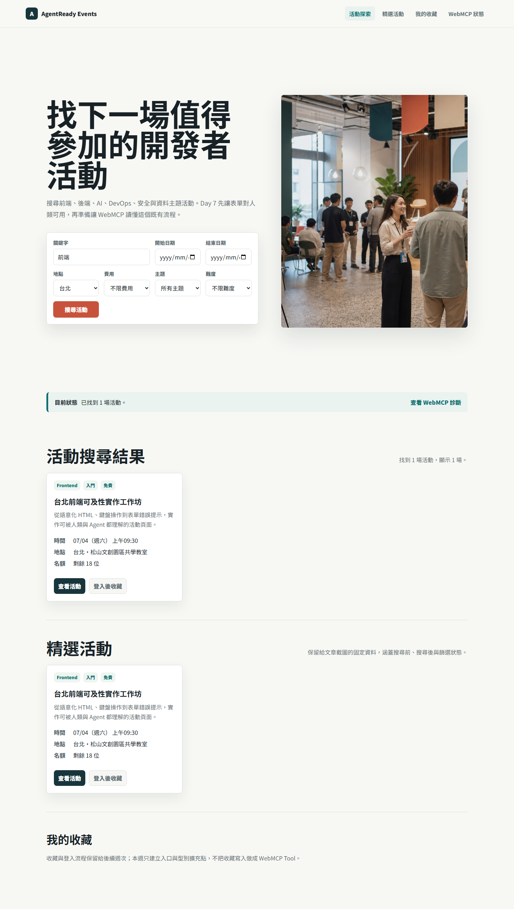
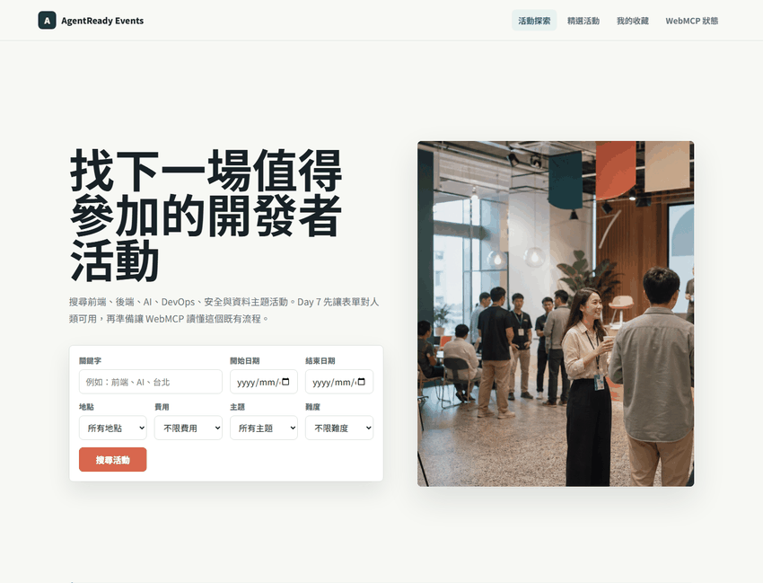

# Day 07｜先有可用 HTML Form，才有 Declarative Tool

> 草稿狀態：可開始細修。
> 對應程式版本：`day-07-human-search`

昨天我們做了 WebMCP diagnostics baseline，先確認網站能跑，也讓瀏覽器的 WebMCP runtime 狀態有地方可以檢查。

今天先不加 `toolname`。

Day 7 的主題是：在成為 Declarative Tool 之前，搜尋表單必須先是一個好用、語意清楚、可以獨立運作的 HTML form。

這句話聽起來很普通，但它是 WebMCP Declarative API 的核心。Declarative Tool 不是把一段壞掉的 UI 貼上 AI 標籤。它應該從原本就可提交、可驗證、可理解的表單長出來。



## 今天要完成什麼

Day 7 要完成一個人類可以正常使用的活動搜尋流程。

本日完成：

- 活動搜尋表單。
- 活動列表。
- `GET /api/events` 查詢。
- URL query state 同步。
- 搜尋前、搜尋後與錯誤狀態。
- 沒有 WebMCP runtime 時仍能使用的搜尋流程。

這些看起來像一般網站功能，但它們會決定後面的 WebMCP 能不能站得住。

Declarative API 的強項，是讓瀏覽器從 HTML form 推導出 Agent 可以理解的工具。既然來源是 form，form 本身的語意就不能混亂。

## Agent-ready 不是 Agent-only

我希望這個系列一直守住一個邊界：Agent-ready 不等於 Agent-only。

網站不應該只有 Agent 才能操作。使用者應該可以用鍵盤、滑鼠、觸控，或一般瀏覽器完成同一件事。

所以 Day 7 的目標不是「讓 AI 搜尋活動」，而是建立一個穩定的人類搜尋流程。等這個流程成立，Day 8 才會把它標記成 `search_events`。

換句話說，WebMCP 加上去以前，網站就應該能回答這些問題：

- 使用者知道每個欄位在填什麼嗎？
- 每個欄位都有可辨識的 `name` 嗎？
- 搜尋送出後，畫面會更新嗎？
- URL 能保留目前查詢條件嗎？
- API 驗證失敗時，畫面能顯示錯誤嗎？
- 沒有 `document.modelContext` 時，使用者仍能完成搜尋嗎？

如果這些都做不到，後面就算加上 WebMCP attribute，Agent 也只是在一個不穩定的介面上嘗試操作。

## 表單語意會成為 Tool 語意

Declarative Tool 的特別之處，是它不要求我們另外手寫一份完整 Tool schema 再和畫面同步。

它會從 HTML form 讀取結構。

這也代表 HTML form 不是前端細節，而是 Tool contract 的來源。

Day 7 先建立這樣的表單結構：

```html
<form id="event-search-form" aria-label="活動搜尋">
  <label for="query">關鍵字</label>
  <input id="query" name="query" type="search" />

  <label for="location">地點</label>
  <select id="location" name="location">
    <option value="">不限地點</option>
    <option value="taipei">台北</option>
    <option value="online">線上</option>
  </select>

  <button type="submit">搜尋活動</button>
</form>
```

這段還不是 WebMCP Tool。

它沒有 `toolname`，沒有 `tooldescription`，也沒有 `toolparamdescription`。這些會留到 Day 8 和 Day 9。

Day 7 只先處理表單作為表單時應該具備的基本條件：

- `label` 對應到欄位。
- `name` 表示欄位送出的參數名稱。
- `type` 提供欄位語意。
- `select` 的 option 有穩定 value。
- submit 會觸發可重複的搜尋流程。

這些都是 Day 9 產生 schema snapshot 的基礎。

## 搜尋流程要能重現

WebMCP demo 最怕的不是畫面醜，而是狀態無法重現。

如果我在文章中說「搜尋台北免費前端活動」，但讀者、測試、截圖流程無法回到同一個狀態，後面的 Agent 行為就很難討論。

所以 Day 7 讓搜尋條件同步到 URL query。

例如：

```text
/?query=frontend&location=taipei&price=free
```

這樣做有三個好處。

第一，使用者可以分享或重新整理目前搜尋條件。

第二，測試可以直接打開特定 URL，檢查畫面是否載入對應結果。

第三，後面 WebMCP submit lifecycle 更新畫面時，我們可以比較「表單值」、「URL query」和「結果列表」是否一致。

這不是為了炫技。它是為了讓 Agent-ready 行為可以被驗證。

## 搜尋結果不是只回文字

Day 7 的搜尋送出後，畫面會更新活動列表。



這個設計會影響 Day 10。

當 Agent 之後呼叫 `search_events` 時，網站不應該只把一段文字塞回給 Agent。使用者也應該在原本的畫面上看到搜尋結果改變。

所以今天先把人類流程做好：

1. 使用者填表。
2. 使用者送出搜尋。
3. 網站呼叫 `GET /api/events`。
4. 網站更新結果列表。
5. 網站更新 URL query。
6. 使用者可以看到目前條件與結果。

Day 10 會把 Agent-like submit path 接到同一個流程上。屆時重點不是另寫一條給 Agent 用的隱藏通道，而是讓 Agent 觸發既有搜尋流程。

## API 是支撐，不是主角

Day 7 也完成 `GET /api/events`。

它支援幾個查詢條件：

| 參數 | 用途 |
| --- | --- |
| `query` | 搜尋活動名稱、摘要或標籤。 |
| `start_date` | 搜尋起始日期。 |
| `end_date` | 搜尋結束日期。 |
| `location` | 篩選地點。 |
| `price` | 篩選免費或付費。 |
| `category` | 篩選活動類別。 |
| `level` | 篩選難度。 |

這裡不用把 API 寫成文章主角。API 的任務是支撐穩定搜尋，讓 WebMCP 後續有真實產品能力可以呼叫。

如果沒有 API，Declarative Tool 只能示範表單被標記；它不能展示搜尋結果如何真正回到使用者畫面。

## 一般搜尋流程

下面這段 GIF 是 Day 7 的主要素材。



這段 GIF 只代表一般使用者搜尋流程：

- 填入搜尋條件。
- 送出表單。
- 更新活動列表。
- 同步 URL query。

它不是 Chrome Agent invocation，也不是 WebMCP runtime 實測。

這個標註很重要。Day 7 還沒有 `toolname`，因此不能說表單已經被 Agent 發現。這一天的證據層級是：網站流程已經可用，且足以支撐下一篇加入 Declarative attributes。

## 今天的程式版本

Day 7 對應的 git tag 是：

```bash
git checkout day-07-human-search
```

切到這個版本時，應該看到一個可用的活動搜尋頁。

這個版本的重點不是 WebMCP attribute，而是「即將成為 Tool 的人類流程」：

- 使用者可以填寫搜尋條件。
- 使用者可以送出搜尋。
- 搜尋結果會更新。
- URL query 會反映目前條件。
- 無 WebMCP 支援時，網站仍可使用。

## 今日完成標準

Day 7 完成後，我期待這個表單符合幾個條件：

- 每個可輸入欄位都有 label。
- 每個要送出的欄位都有 `name`。
- 欄位型別符合資料語意。
- 搜尋按鈕是正常 submit button。
- 搜尋結果會更新可見 UI。
- 搜尋條件會同步到 URL。
- API 驗證錯誤可以顯示在畫面上。
- 沒有 WebMCP runtime 時，搜尋流程仍可完成。

這些標準看似和 AI 無關，卻是 Declarative Tool 的地基。

## 小結

Day 7 做的是一件很樸素的事：把活動搜尋做成一個正常網站功能。

但對 WebMCP 來說，這一步不只是前置作業。它決定了後面 Agent 看到的 Tool 是否有清楚來源、穩定參數和可重複結果。

明天才會加入 `toolname` 和 `tooldescription`，讓這個搜尋表單開始具備 Declarative Tool 的身份。

今天先停在更基本的位置：先讓人類用得好，再讓 Agent 看得懂。

## Reality Checklist 自審

發布前套用：`docs/06-webmcp-reality-checklist.md`

- [x] 本文強調先做出人類可用的 HTML form。
- [x] 本文沒有宣稱表單已被 WebMCP 發現。
- [x] 本文把搜尋 GIF 標註為一般使用者搜尋流程。
- [x] 本文有說明無 WebMCP 支援時，網站仍可使用。
- [x] 本文沒有宣稱 Day 7 已加入 `toolname`、`tooldescription` 或 `toolparamdescription`。
- [x] 本文沒有把搜尋流程寫成 Chrome Agent invocation。

> 本文截圖與 GIF 來自本地 demo 與 Playwright 流程驗證，用來說明一般搜尋流程與後續 Declarative Tool 的基礎；實際 Chrome / WebMCP runtime 支援狀態需依目標瀏覽器版本另行驗證。
