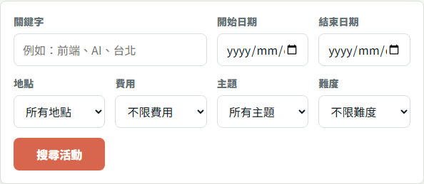
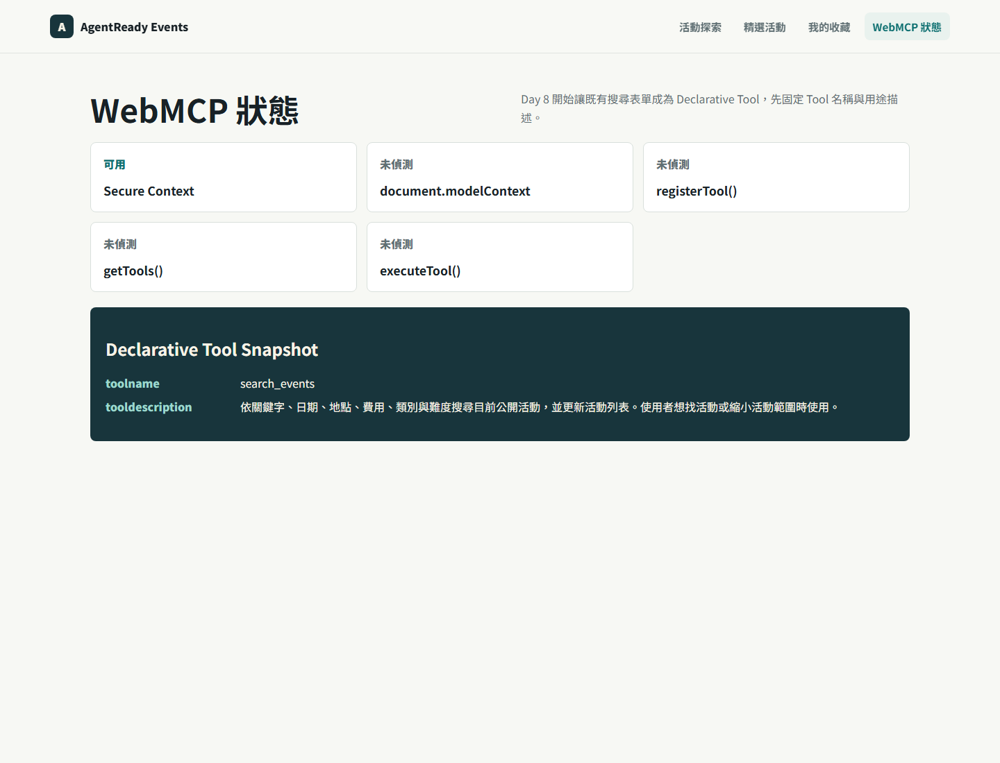

# Day 08｜建立 `search_events` 的 Tool Identity

> 草稿狀態：可開始細修。
> 對應程式版本：`day-08-search-events-identity`

昨天我們先把活動搜尋做成一般使用者可以操作的 HTML form。

今天才開始加入 WebMCP Declarative API。

Day 8 只做一件事：替既有搜尋表單建立穩定的 Tool identity。也就是加入 `toolname` 和 `tooldescription`。

這一步看起來很小，但它改變了表單的角色。昨天它只是搜尋表單；今天它開始表達：「如果瀏覽器支援 WebMCP Declarative API，這個 form 可以被視為一個名叫 `search_events` 的工具。」



## 今天要完成什麼

Day 8 要把 Day 7 的搜尋表單標記成第一個 Declarative Tool。

本日完成：

- 在搜尋表單加入 `toolname="search_events"`。
- 在搜尋表單加入固定的 `tooldescription`。
- 讓 diagnostics page 顯示 Tool identity snapshot。
- 確認沒有 WebMCP runtime 時，表單仍能用一般方式提交。

今天不處理欄位層級描述。`name`、`toolparamdescription` 和 schema snapshot 會留到 Day 9。

今天也不處理自動提交。`toolautosubmit`、`agentInvoked`、`respondWith()` 和 lifecycle 狀態會留到 Day 10。

## Declarative Tool 從 Form 長出來

Day 8 的改動很集中。

原本的搜尋表單已經有 `action`、`method`、`label`、`name` 和可提交流程。今天只在同一個 form 上補兩個 WebMCP attribute：

```html
<form
  id="search-form"
  action="/api/events"
  method="get"
  toolname="search_events"
  tooldescription="依關鍵字、日期、地點、費用、類別與難度搜尋目前公開活動，並更新活動列表。使用者想找活動或縮小活動範圍時使用。"
>
  <!-- 搜尋欄位延續 Day 7 的 HTML form -->
</form>
```

這段程式表達一個重要選擇：`search_events` 不是另一份隱藏設定，也不是另外用 JavaScript 手寫一個重複 Tool schema。

它直接長在搜尋表單上。

這也是 Declarative API 和一般 imperative 註冊方式最大的差異之一。Declarative 的來源是 HTML form；form 是使用者介面，也是 Tool contract 的起點。

## `toolname` 是穩定合約

`toolname` 是 Agent 選工具時會看到的名稱。

這個名稱不應該跟著 UI 文案變動。

例如畫面上的按鈕可以叫「搜尋活動」、「找活動」、「套用篩選」。頁面標題也可以從「活動探索」改成「精選技術活動」。但 Tool name 仍然應該固定：

```html
toolname="search_events"
```

我在 Tool Catalog 裡把命名規則固定成英文小寫蛇形，也就是 `lower_snake_case`。

原因有三個。

第一，Tool name 是給 Agent 和程式流程看的，不是給使用者閱讀的標題。

第二，英文小寫蛇形比較適合跨語系維持穩定。網站 UI 可以是繁體中文，但 Tool name 不應該今天叫 `搜尋活動`，明天又改成 `找活動`。

第三，後面測試、文件、截圖和錯誤排查都會引用這個名稱。名稱一旦不穩定，整個系列的證據也會跟著鬆掉。

## `tooldescription` 是選工具的訊號

`tooldescription` 不是 SEO description，也不是 UI help text。

它要回答的是：在什麼情境下，Agent 應該選這個 Tool？

本專案把 `search_events` 的描述固定為：

```text
依關鍵字、日期、地點、費用、類別與難度搜尋目前公開活動，並更新活動列表。使用者想找活動或縮小活動範圍時使用。
```

這句話刻意包含兩種資訊。

第一，它描述能力範圍：依關鍵字、日期、地點、費用、類別與難度搜尋目前公開活動。

第二，它描述適用時機：使用者想找活動或縮小活動範圍時使用。

這比「搜尋活動」四個字更有用。因為 Agent 不只需要知道工具做什麼，也需要判斷什麼時候該用它。

例如使用者說：

```text
幫我找這個週末台北免費的前端活動。
```

這個需求符合 `search_events` 的描述。

但如果使用者說：

```text
幫我報名第一場活動。
```

這不應該直接使用 `search_events` 完成報名。搜尋 Tool 只能縮小活動範圍，它不能替使用者做報名承諾。

`tooldescription` 的工作，就是把這種邊界寫清楚。

## Catalog 文字要和 HTML Attribute 對齊

Day 8 有一個容易忽略的維護問題：Tool Catalog 寫一份，HTML attribute 又寫一份。

如果兩邊不同步，文件會說一套，實作會說另一套。

所以我把 `toolname` 和 `tooldescription` 收斂成常數：

```ts
export const SEARCH_EVENTS_TOOL_NAME = "search_events";

export const SEARCH_EVENTS_TOOL_DESCRIPTION =
  "依關鍵字、日期、地點、費用、類別與難度搜尋目前公開活動，並更新活動列表。使用者想找活動或縮小活動範圍時使用。";
```

表單和 diagnostics snapshot 都引用同一份常數。

這樣做不是為了抽象化而抽象化，而是為了讓文章、Catalog、程式和截圖對得起來。當 Day 9 顯示 schema snapshot，Day 10 處理 submit lifecycle 時，我們仍然能確認自己談的是同一個 `search_events`。

## Diagnostics 只顯示身份，不代表真實呼叫

Day 8 也讓 diagnostics page 顯示 Declarative Tool Snapshot。



這張圖的用途是確認目前專案已經把 Tool identity 寫進程式：

- `toolname`
- `tooldescription`

但它不是 Chrome Agent 呼叫成功的證據。

它也不是瀏覽器最終產生的完整正式 schema。

Day 8 的證據層級是 E1：靜態實作已完成。也就是 HTML attribute 和 diagnostics snapshot 已經存在。若要證明真實 WebMCP runtime 會發現並呼叫 `search_events`，還需要另外記錄目標 Chrome 版本、runtime 支援狀態和 invocation 證據。

這個界線要守住。否則文章會把「我們寫了 Declarative attributes」誤寫成「Agent 已經成功使用 Tool」。

## 漸進增強仍然成立

加上 `toolname` 和 `tooldescription` 之後，搜尋表單仍然是一個普通 HTML form。

沒有 WebMCP runtime 時，使用者仍然可以：

1. 填寫搜尋條件。
2. 按下搜尋按鈕。
3. 看到活動列表更新。
4. 透過 URL query 保留搜尋狀態。

這是漸進增強的關鍵。

WebMCP 不是取代網站原本的互動方式，而是在原本可用的互動上增加一層結構化語意。Day 7 做好人類流程，Day 8 才有東西可以標記。

## 今天的程式版本

Day 8 對應的 git tag 是：

```bash
git checkout day-08-search-events-identity
```

切到這個版本時，應該看到 Day 7 的搜尋流程仍然可用，並且搜尋表單已經帶有 `search_events` 的 Tool identity。

這個版本的重點很窄：

- 有 `toolname`。
- 有 `tooldescription`。
- Tool name 固定為 `search_events`。
- `tooldescription` 和 Tool Catalog 文字一致。
- 尚未加入 `toolautosubmit`。
- 尚未處理 submit lifecycle。

## 今日完成標準

Day 8 完成後，我期待這個版本符合幾個條件：

- 搜尋表單保留 Day 7 的一般搜尋能力。
- 搜尋表單加入 `toolname="search_events"`。
- 搜尋表單加入固定的 `tooldescription`。
- Tool name 不翻成中文。
- `tooldescription` 描述功能與適用時機，而不是 UI 操作細節。
- Diagnostics page 可以顯示 Tool identity snapshot。
- 沒有宣稱真實 Agent 已經發現或呼叫此 Tool。

這些完成後，`search_events` 有了身份，但還沒有完整參數描述。

下一步才是 Day 9：讓每個欄位的語意也能被看見。

## 小結

Day 8 的重點不是寫更多前端功能，而是替 Day 7 的搜尋表單補上 WebMCP identity。

`toolname` 讓工具有穩定名稱。

`tooldescription` 讓 Agent 有判斷適用情境的依據。

這兩個 attribute 加上去之後，我們可以說：專案已完成 `search_events` Declarative identity 的靜態實作。

我們還不能說：Chrome Agent 已經真實發現並呼叫 `search_events`。

這個差別，會讓後面的 Day 9 和 Day 10 更乾淨。

## Reality Checklist 自審

發布前套用：`docs/06-webmcp-reality-checklist.md`

- [x] 本文只宣稱加入 `toolname` 與 `tooldescription`。
- [x] 本文使用的 `tooldescription` 和 Tool Catalog 文字一致。
- [x] 本文沒有宣稱已完成 `toolautosubmit`。
- [x] 本文沒有宣稱已完成 submit lifecycle。
- [x] 本文沒有把 Tool name 翻成中文。
- [x] 本文沒有把 diagnostics snapshot 寫成 Chrome Agent invocation。
- [x] 本文有說明實際 Chrome / WebMCP runtime 支援狀態需要另行驗證。

證據層級：

> 本文停在 `search_events` Declarative identity 的靜態實作；尚未證明目標 runtime 已完成 discovery 或 invocation。
