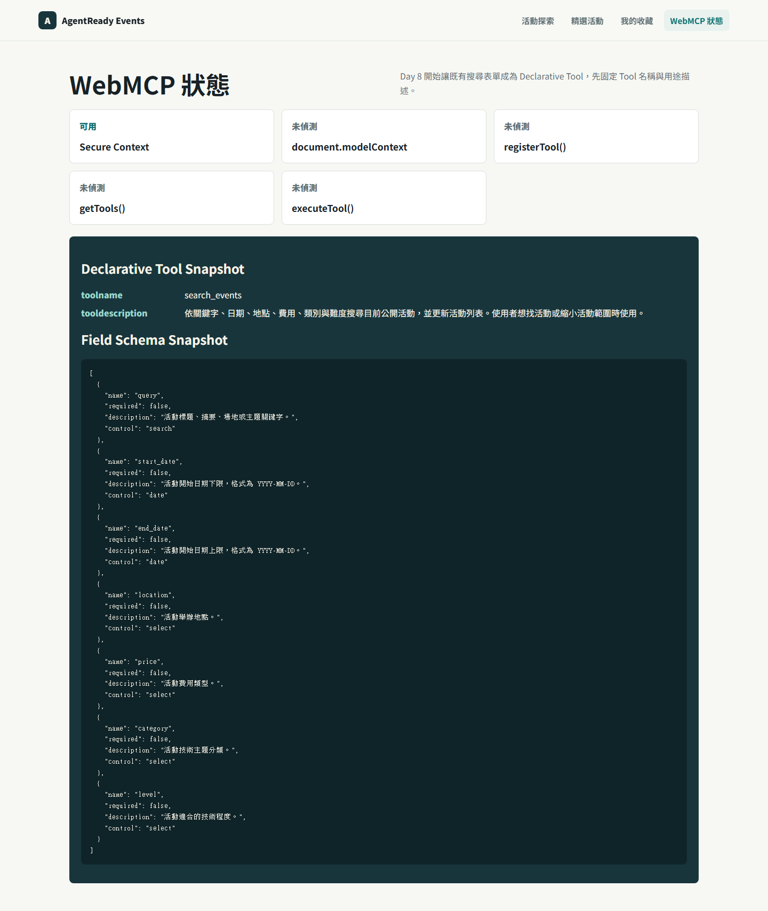
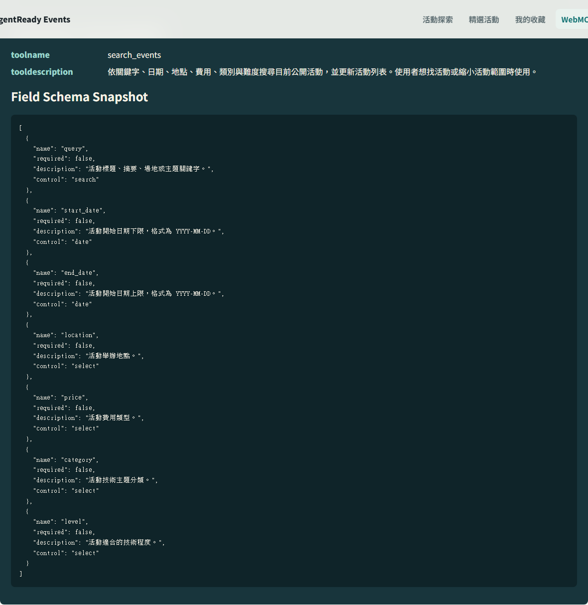

# Day 09｜讓參數語意浮出來：`name`、`toolparamdescription` 與 Schema Snapshot

> 草稿狀態：可開始細修。
> 對應程式版本：`day-09-search-events-schema`

昨天我們讓搜尋表單有了 Tool identity：`search_events`。

今天要處理下一層問題：Agent 不只需要知道有一個搜尋工具，也需要知道這個工具可以填哪些參數。

在 Declarative API 裡，參數不是從另一份手寫 schema 開始，而是從 HTML form 欄位長出來。這代表每個欄位的 `name`、`type`、`select option`、`required` 和 `toolparamdescription` 都會影響 Tool inputs 的可理解性。

Day 9 的重點不是讓 Agent 執行搜尋。那是 Day 10。

Day 9 的重點是讓 `search_events` 的輸入語意變清楚。



## 今天要完成什麼

Day 9 要把 `search_events` 從「有名稱的搜尋 Tool」推進到「參數語意可觀察的搜尋 Tool」。

本日完成：

- 確認每個搜尋欄位都有穩定的 `name`。
- 使用合適的 input type 和 select options。
- 補上欄位層級的 `toolparamdescription`。
- 在 diagnostics page 顯示欄位 schema snapshot。
- 明確標註 snapshot 是專案觀察素材，不是 Chrome 永久正式輸出格式。

這一天仍然不做 `toolautosubmit`。

也不宣稱真實 Chrome Agent 已經呼叫 `search_events`。

## Tool Identity 不等於 Tool Inputs

Day 8 的 `toolname` 和 `tooldescription` 解決的是 Tool identity。

它們回答：

- 這個 Tool 叫什麼？
- 這個 Tool 適合什麼情境？

Day 9 要回答另一組問題：

- 這個 Tool 有哪些參數？
- 每個參數代表什麼？
- 哪些值是可選範圍？
- 哪些欄位需要格式限制？

這個差別很重要。

如果只寫：

```html
<form toolname="search_events" tooldescription="...">
```

Agent 可能知道這是一個搜尋活動的工具，但還不一定能準確理解每個欄位的用途。`query`、`start_date`、`end_date`、`location` 對工程師很直覺，對 Agent 來說仍需要語意線索。

## `name` 是參數名稱

HTML form 的 `name` 是欄位送出時的參數名稱。

在 AgentReady Events 裡，它同時接到三個地方：

- 前端表單欄位。
- 後端 `GET /api/events` query。
- `search_events` 的 Declarative Tool inputs。

例如：

```html
<input
  id="query"
  name="query"
  type="search"
/>
```

這裡的 `name="query"` 不只是 HTML 細節。它會成為搜尋關鍵字的參數名稱，也會出現在 URL query 和 API contract 裡。

所以 `name` 不能隨便改。

如果今天前端把它改成 `keyword`，但後端仍讀 `query`，人類搜尋流程會壞掉。若 WebMCP runtime 依 form 建立參數，Agent 看到的參數名稱也會跟著改變。

Day 9 先把這件事說清楚：欄位名稱就是合約的一部分。

## Type 和 Options 提供結構線索

欄位型別會提供基本結構線索。

例如日期欄位使用 `type="date"`：

```html
<input
  id="start_date"
  name="start_date"
  type="date"
  toolparamdescription="活動開始日期下限，格式為 YYYY-MM-DD。"
/>
```

這比一般文字欄位更清楚。它告訴瀏覽器和後續 schema 觀察流程：這個欄位期待日期。

`select` 則提供允許值。

例如地點：

```html
<select
  id="location"
  name="location"
  toolparamdescription="活動舉辦地點。"
>
  <option value="all">所有地點</option>
  <option value="taipei">台北</option>
  <option value="online">線上</option>
</select>
```

這裡有兩層語意。

第一，使用者看到的是「台北」、「線上」。

第二，系統送出的是 `taipei`、`online`。

對 WebMCP 來說，這些 option value 是重要的輸入邊界。Agent 不應該憑空填入 `Taipei City`、`台北市` 或其他後端不接受的值。

## `toolparamdescription` 補參數語意

`label` 是給人看的。

`toolparamdescription` 是給 Tool parameter 語意看的。

它不應該只是重複 label。

例如 label 寫「關鍵字」，但 `toolparamdescription` 可以補得更具體：

```html
<input
  id="query"
  name="query"
  type="search"
  toolparamdescription="活動標題、摘要、場地或主題關鍵字。"
/>
```

這句描述讓參數更清楚。`query` 不只是任意字串，而是用來搜尋活動標題、摘要、場地或主題。

Day 9 目前替搜尋欄位補上這些描述：

| 參數 | 描述 |
| --- | --- |
| `query` | 活動標題、摘要、場地或主題關鍵字。 |
| `start_date` | 活動開始日期下限，格式為 YYYY-MM-DD。 |
| `end_date` | 活動開始日期上限，格式為 YYYY-MM-DD。 |
| `location` | 活動舉辦地點。 |
| `price` | 活動費用類型。 |
| `category` | 活動技術主題分類。 |
| `level` | 活動適合的技術程度。 |



這些描述不是 UI 文案。它們的目的不是讓畫面更漂亮，而是讓 Tool inputs 更容易被理解。

## Schema Snapshot 是觀察工具

Day 9 的 diagnostics page 會顯示 schema snapshot。

程式會從目前表單讀出欄位資訊：

```ts
export interface DeclarativeFieldSchema {
  name: string;
  required: boolean;
  description: string;
  control: string;
}
```

接著整理每個欄位：

```ts
export function buildDeclarativeFieldSchema(form: HTMLFormElement): DeclarativeFieldSchema[] {
  return Array.from(form.elements)
    .filter((element): element is HTMLInputElement | HTMLSelectElement => {
      return element instanceof HTMLInputElement || element instanceof HTMLSelectElement;
    })
    .filter((element) => Boolean(element.name))
    .map((element) => ({
      name: element.name,
      required: element.required,
      description: element.getAttribute("toolparamdescription") ?? "",
      control: element.tagName.toLowerCase() === "select"
        ? "select"
        : element.getAttribute("type") ?? "text"
    }));
}
```

這份 snapshot 對文章很有用。

它讓我們可以檢查目前表單是否真的提供了：

- 參數名稱。
- 欄位是否必填。
- 欄位描述。
- 控制項類型。

但它有清楚限制。

這不是 Chrome 最終輸出的永久 schema 格式。它是專案用來觀察表單語意的 snapshot。

WebMCP Declarative API 仍在演進，Chrome 對 HTML form 合成 schema 的細節也需要依當前版本驗證。文章可以展示專案如何整理欄位語意，但不能把這份 snapshot 寫成瀏覽器永久保證。

## `required` 也要小心解讀

Day 9 的 snapshot 會顯示 `required`。

這個欄位很直觀：HTML 控制項有 `required`，snapshot 就顯示 `true`；沒有就顯示 `false`。

但對搜尋工具來說，大多數欄位不該必填。

使用者可能只想搜尋「AI」，也可能只想找「線上」活動。`search_events` 應該允許空條件搜尋，或只用少數條件縮小範圍。

所以 Day 9 不會為了讓 schema 看起來完整，就硬把欄位改成必填。

這是產品行為優先於展示效果的地方。Tool 的參數約束應該反映真實使用流程，而不是為了截圖變得漂亮。

## Diagnostics 不是 Runtime 實測

Day 9 的截圖會讓 schema 看起來很完整。

也正因如此，這篇更需要把證據邊界寫清楚。

目前可以說：

- 搜尋表單已有 `name`。
- 搜尋表單已有合適的 input type 和 select options。
- 搜尋表單已有 `toolparamdescription`。
- Diagnostics page 可以顯示專案用 schema snapshot。

目前不能說：

- Chrome Agent 已經讀到並正確使用這份 schema。
- Snapshot 是 Chrome 永久輸出的正式格式。
- Declarative API 已提供與 Imperative annotations 完全對等的能力。

若要把這篇升級成真實 runtime 實測，需要另外記錄 Chrome 版本、WebMCP runtime 支援狀態、實際 discovery 或 invocation 的證據。

## 今天的程式版本

Day 9 對應的 git tag 是：

```bash
git checkout day-09-search-events-schema
```

切到這個版本時，搜尋表單應該保留 Day 8 的 Tool identity，並且每個搜尋欄位都補上欄位語意。

這個版本的重點是：

- `name` 作為參數名稱。
- input type 作為基本型別線索。
- select options 作為允許值線索。
- `toolparamdescription` 作為參數說明。
- schema snapshot 作為文章素材與回歸檢查工具。

## 今日完成標準

Day 9 完成後，我期待這個版本符合幾個條件：

- 搜尋欄位都有穩定的 `name`。
- 日期欄位使用 `type="date"`。
- 搜尋欄位使用 `type="search"`。
- select 欄位有清楚且穩定的 option value。
- 欄位有必要的 `toolparamdescription`。
- Diagnostics page 顯示 schema snapshot。
- Snapshot 標註為 project snapshot，不寫成 Chrome 永久正式 schema。
- 文章有提醒 Declarative API 規格與實作仍需依當前版本確認。

完成這些後，`search_events` 才不只是「有名字的搜尋工具」，而是開始有可讀的輸入語意。

## 小結

Day 9 把 WebMCP Declarative API 的焦點從 Tool identity 推進到 Tool inputs。

`name` 讓欄位有參數名稱。

`type` 和 `select option` 提供結構線索。

`toolparamdescription` 補上 Agent 理解欄位時需要的上下文。

Schema snapshot 讓我們能檢查這些語意是否真的存在，但它不是 Chrome 永久輸出格式，也不是 Agent 已經成功呼叫 Tool 的證據。

明天 Day 10 才會把這些輸入語意接到 submit lifecycle：`toolautosubmit`、`agentInvoked`、`respondWith()` 和可見狀態回饋。

## Reality Checklist 自審

發布前套用：`docs/06-webmcp-reality-checklist.md`

- [x] 本文說明 `name`、input type、select options 與 `toolparamdescription` 的角色。
- [x] 本文把 Schema 圖片標註為 project snapshot。
- [x] 本文沒有宣稱 snapshot 是 Chrome 永久輸出格式。
- [x] 本文有提醒 Declarative API 規格與實作仍需依當前版本確認。
- [x] 本文沒有宣稱 Chrome Agent 已經讀取或使用這份 schema。
- [x] 本文沒有宣稱 Declarative API 已提供與 Imperative annotations 完全對等的能力。

證據層級：

> 本文停在 project schema snapshot，用來觀察 `search_events` 的欄位語意；Chrome 實際 schema 合成格式需依目標版本驗證。
