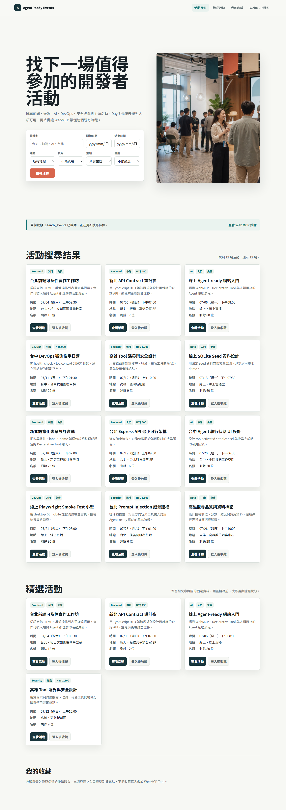
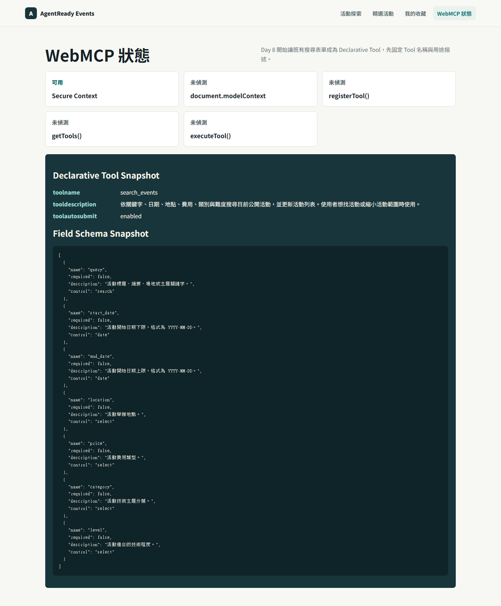
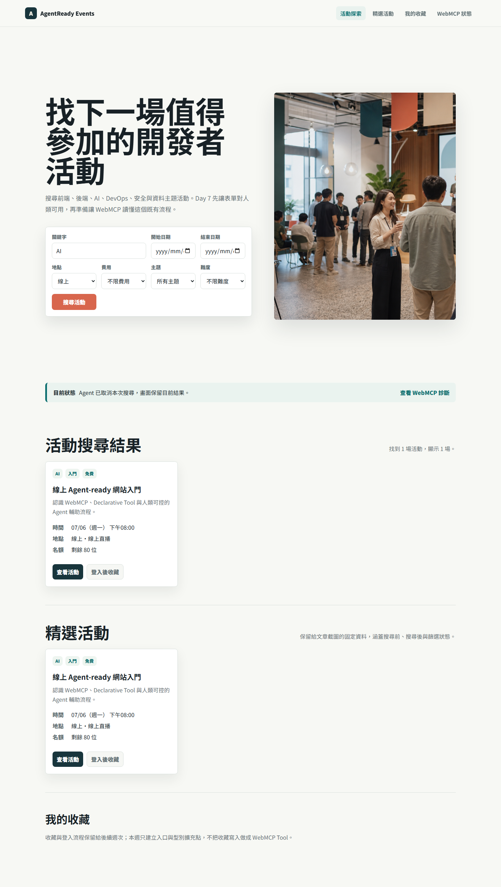
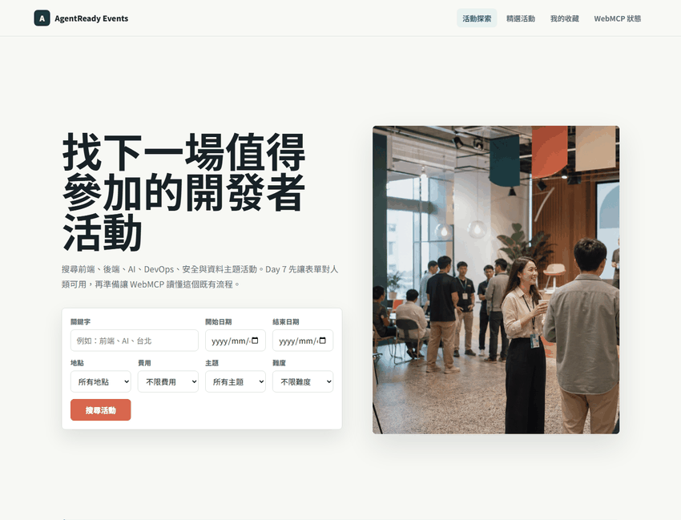

# Day 10｜讓 `search_events` 跑完一圈：`toolautosubmit`、`respondWith()` 與可見狀態

> 草稿狀態：可開始細修。
> 對應程式版本：`day-10-agent-submit-loop`

前四天我們一步一步把搜尋表單變成 Declarative Tool。

Day 6 建 diagnostics baseline。Day 7 做人類可用的 HTML form。Day 8 加上 `toolname` 與 `tooldescription`。Day 9 補齊欄位語意與 schema snapshot。

今天要完成第一個執行閉環。

Day 10 的主題是：當 `search_events` 被 Agent-like 流程提交時，網站如何執行搜尋、更新畫面、回傳結果，並讓使用者看見狀態。

本文先用本地流程驗證呈現這個閉環；真實 Chrome / WebMCP runtime invocation 會在後續另行補證據。



## 今天要完成什麼

Day 10 要讓 `search_events` 形成第一個可觀察的 submit loop。

本日完成：

- 在 `search_events` 表單加入 `toolautosubmit`。
- 用 `SubmitEvent.agentInvoked` 區分一般提交與 Agent-like 提交。
- 在 submit handler 裡呼叫 `preventDefault()`。
- 用 `respondWith()` 回傳可序列化的 `ToolResult`。
- 處理 `toolactivated` 和 `toolcancel`。
- 讓使用者在畫面上看見 Agent-like 流程狀態。

這一天仍然只做搜尋。

不做報名、不做收藏寫入、不做登入，也不讓 Agent 替使用者做任何高風險承諾。

## 為什麼搜尋可以 `toolautosubmit`

`toolautosubmit` 代表 Agent 填入欄位後，可以自動提交表單。

這個能力不能亂用。

我只把它加在 `search_events`，原因是搜尋符合幾個條件：

- 低風險。
- 唯讀。
- 可重複執行。
- 不改變伺服器資料。
- 不代表使用者做承諾。
- 結果會更新在可見 UI 上。

所以 Day 10 的表單變成：

```html
<form
  id="search-form"
  action="/api/events"
  method="get"
  toolname="search_events"
  tooldescription="依關鍵字、日期、地點、費用、類別與難度搜尋目前公開活動，並更新活動列表。使用者想找活動或縮小活動範圍時使用。"
  toolautosubmit
>
  <!-- search fields -->
</form>
```

這不代表 `toolautosubmit` 適合所有表單。

報名、取消、付款、登入、刪除資料都不應該直接照這個模式做。那些流程需要更強的人類確認、授權與風險控管。

Day 10 只示範低風險搜尋 Tool。



## 同一個 Submit Handler，同一條搜尋流程

Day 10 不另外寫一條只給 Agent 用的隱藏流程。

不管是人類按下搜尋按鈕，還是 Agent-like submit path 觸發表單，最後都進同一個 handler：

```ts
function handleSearchSubmit(event: SubmitEvent): void {
  event.preventDefault();
  const declarativeEvent = event as DeclarativeSubmitEvent;
  const form = event.currentTarget as HTMLFormElement;
  const query = readQueryFromForm(form);

  const task = runSearch(query, {
    updateUrl: true,
    agentInvoked: Boolean(declarativeEvent.agentInvoked)
  }).then((response) => ({
    ok: true,
    message: `已更新活動列表，共找到 ${response.total} 場活動。`,
    data: response
  })).catch((error: unknown) => ({
    ok: false,
    message: error instanceof Error ? error.message : "搜尋活動時發生錯誤。"
  }));

  declarativeEvent.respondWith?.(task);
}
```

這段程式有四個重點。

第一，先呼叫 `preventDefault()`。搜尋由網站自己的 handler 接手，不讓瀏覽器直接跳頁。

第二，從同一個表單讀取 query。這延續 Day 7 的人類流程，不建立另一份 Agent-only 參數來源。

第三，`agentInvoked` 只改變狀態回饋，不改變搜尋規則。Agent-like 提交和人類提交應該拿到一致結果。

第四，`respondWith()` 回傳搜尋結果摘要與資料，讓呼叫端知道搜尋已完成或失敗。

## `respondWith()` 回傳結果，不替使用者決策

`respondWith()` 的任務不是替使用者做下一步決定。

在這個版本中，回傳型別是：

```ts
export interface ToolResult<TData> {
  ok: boolean;
  message: string;
  data?: TData;
}
```

成功時回傳：

```ts
{
  ok: true,
  message: `已更新活動列表，共找到 ${response.total} 場活動。`,
  data: response
}
```

失敗時回傳：

```ts
{
  ok: false,
  message: "搜尋活動時發生錯誤。"
}
```

這個結果只說明搜尋狀態。

它不代表使用者已經收藏活動、已經報名、已經同意任何條款，也不代表 Agent 可以接著自動完成高風險操作。

Day 10 完成的是搜尋閉環，不是完整活動旅程。


## `agentInvoked` 讓狀態更清楚

`agentInvoked` 讓網站知道這次 submit 來自 Agent-like 情境。

在實作裡，搜尋規則沒有因為它而改變，但畫面狀態會更清楚：

```ts
state.message = options.agentInvoked
  ? "Agent 正在協助搜尋活動。"
  : "正在搜尋活動。";
```

這個差異很小，但對使用者很重要。

如果 Agent 正在協助填表或提交，使用者應該知道目前不是自己剛剛手動按了一次搜尋，而是 Agent-like 流程正在介入同一個搜尋表單。

可見狀態是信任的基礎。不要讓 Agent 行為只在背景發生。

## `toolactivated` 和 `toolcancel` 是可見回饋

Day 10 也處理兩個 lifecycle event：

```ts
form.addEventListener("toolactivated", handleToolActivated);
form.addEventListener("toolcancel", handleToolCancel);
```

`toolactivated` 用來告訴使用者：某個 Tool 流程已經開始。

```ts
function handleToolActivated(event: Event): void {
  const toolEvent = event as ToolLifecycleEvent;
  state.message = `${toolEvent.toolName ?? SEARCH_EVENTS_TOOL_NAME} 已啟動，正在更新搜尋條件。`;
  state.error = "";
  render();
}
```

`toolcancel` 用來告訴使用者：這次流程被取消，而且畫面保留目前結果。

```ts
function handleToolCancel(): void {
  state.message = "Agent 已取消本次搜尋，畫面保留目前結果。";
  state.error = "";
  render();
}
```



這兩個事件不是安全授權機制。

它們不負責判斷使用者是否同意報名，也不負責保護高風險操作。它們的角色是可見狀態回饋：讓使用者知道 Agent-like 流程開始了、停止了，或目前停在哪裡。

安全決策要放在更明確的權限、確認與風險邊界裡。這些會留到後續週次處理。

## 本地流程驗證，不是真實 Runtime 實測

下面這段 GIF 串起 Day 10 的流程。



這段 GIF 展示：

- Tool active 狀態。
- Agent-like submit path。
- 搜尋結果更新。
- `respondWith()` 對應的完成狀態。
- cancel 狀態回饋。

但它仍然是本地流程驗證素材。

它不是 Chrome Agent 已真實發現並呼叫 `search_events` 的證據。

依照 reality checklist，目前可以說的是：

- 網站已處理 `agentInvoked`、`respondWith()`、`toolactivated` 與 `toolcancel` 的程式路徑。
- Playwright 可以對本地網站做流程驗證與素材截圖。
- `search_events` 的 Declarative submit lifecycle handling 已完成。

目前不能說的是：

- 真實 Chrome Agent 已完成 invocation。
- Playwright dispatch 的事件等同於真實 Agent runtime。
- 目標 Chrome / WebMCP runtime 已完整支援本專案所有行為。

如果後續要升級成 E3/E4 等級證據，必須另外記錄 Chrome 版本、flag 或 origin trial 狀態、`document.modelContext` 偵測結果，以及 DevTools 或 Agent invocation 證據。

## 今天的程式版本

Day 10 對應的 git tag 是：

```bash
git checkout day-10-agent-submit-loop
```

切到這個版本時，`search_events` 已經具備 Day 6 到 Day 10 的累積能力：

- Diagnostics baseline。
- 人類可用搜尋表單。
- `toolname` 與 `tooldescription`。
- 欄位 `name`、型別、選項與 `toolparamdescription`。
- `toolautosubmit`。
- `agentInvoked`。
- `respondWith()`。
- `toolactivated` 和 `toolcancel` 可見狀態。

這是第一個 Declarative Tool 的本地實作閉環。

## 今日完成標準

Day 10 完成後，我期待這個版本符合幾個條件：

- `toolautosubmit` 只套用在低風險搜尋 Tool。
- 一般搜尋與 Agent-like 搜尋共用同一個 submit handler。
- Submit handler 呼叫 `preventDefault()`。
- `respondWith()` 回傳可序列化的搜尋結果或錯誤訊息。
- 搜尋結果更新原本的活動列表。
- URL query 與表單狀態同步。
- `toolactivated` 顯示 Agent-like 流程已啟動。
- `toolcancel` 顯示流程取消，並保留目前結果。
- 文章和截圖不宣稱真實 Chrome Agent invocation。

這些標準完成後，Day 6 到 Day 10 就收束成一個完整主題：從 runtime baseline 到第一個低風險 Declarative Tool 的本地閉環。

## 小結

Day 10 讓 `search_events` 跑完第一圈。

`toolautosubmit` 讓低風險搜尋可以自動提交。

`agentInvoked` 讓網站知道這次提交來自 Agent-like 情境。

`respondWith()` 讓 submit handler 回傳搜尋結果。

`toolactivated` 和 `toolcancel` 讓使用者看見流程開始與取消。

但這一切仍要守住真實性邊界：目前完成的是本地實作與流程驗證，不是真實 Chrome Agent runtime 的完整實測。

這個邊界不是保守，而是讓後面的文章有可信度。下一階段會進入 Imperative API，從 Day 11 開始用程式註冊活動詳情工具。

## Reality Checklist 自審

發布前套用：`docs/06-webmcp-reality-checklist.md`

- [x] 本文明確說 `toolautosubmit` 只用於低風險搜尋。
- [x] 本文把 GIF 標註為本地流程驗證與 Agent-like lifecycle simulation。
- [x] 本文沒有宣稱真實 Chrome Agent 已完成 invocation。
- [x] 本文有說明 `respondWith()` 回傳搜尋結果，不代表替使用者做後續決策。
- [x] 本文有區分 `toolactivated`、`toolcancel` 是可見狀態回饋，不是安全授權機制。
- [x] 本文沒有把 `toolautosubmit` 推廣到報名、取消、登入或其他高風險流程。

證據層級：

> 本文停在本地 Agent-like lifecycle simulation；真實 invocation 需另行補 Chrome 版本、runtime 狀態與可重現呼叫證據。
